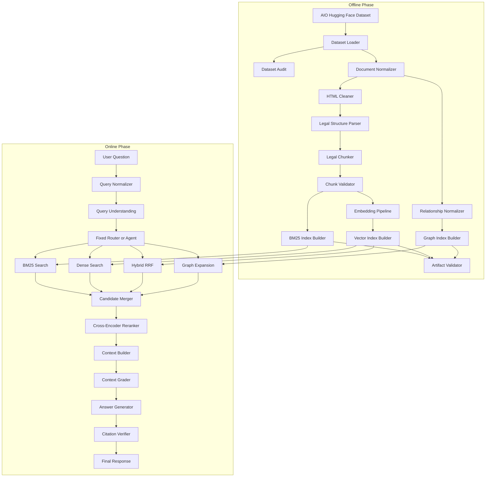

# 04. System Architecture

## 1. Architecture Principles

Hệ thống tuân thủ các nguyên tắc:

- modularity;
- separation of concerns;
- offline-online separation;
- unified schema;
- dataset independence;
- retrieval-first development;
- reproducibility;
- observability;
- testability;
- backend abstraction;
- competition adaptability;
- bounded agent behavior.

---

## 2. High-Level Architecture



---

## 3. Architecture Layers

### 3.1 Data Layer

Chịu trách nhiệm:

- dataset loading;
- raw schema mapping;
- audit;
- normalization;
- raw data provenance.

Dataset-specific logic kết thúc tại layer này.

### 3.2 Processing Layer

Chịu trách nhiệm:

- HTML cleaning;
- legal structure parsing;
- legal chunking;
- chunk validation;
- metadata enrichment.

### 3.3 Indexing Layer

Chịu trách nhiệm:

- BM25 index;
- vector index;
- graph index;
- artifact persistence;
- manifests;
- backend abstraction.

### 3.4 Retrieval Layer

Chịu trách nhiệm:

- sparse retrieval;
- dense retrieval;
- RRF fusion;
- graph expansion;
- reranking;
- retrieval trace.

Cross-encoder input dùng unified legal metadata cùng chunk text để giữ phạm vi
văn bản trong quyết định rerank. Adapter chỉ đọc các field đã định danh:
document title/number/type, issuing authority, legal field, effect metadata và
legal structure. Raw dataset fields không đi vào reranker.

Milestone 19 bổ sung query-understanding service dùng chung cho fixed runtime và
Agent. Service chỉ trích xuất tín hiệu có trong câu hỏi, tạo bounded variants
không thêm kiến thức pháp luật, và đưa typed analysis vào `RetrievalQuery`.
Hybrid retrieval có thể chạy BM25/dense trên nhiều variant rồi RRF toàn bộ
branch ranks; mỗi contribution được giữ trong retrieval trace. Artifact và
backend contract không thay đổi.

### 3.5 Generation and Verification Layer

Chịu trách nhiệm:

- context building;
- answer generation;
- evidence citation;
- citation verification;
- insufficient evidence behavior.

Milestone 20 thêm deterministic evidence selector giữa retrieval/reranking và
context packaging. Selector dùng source rank, lexical overlap, explicit
document/article reference và effect-status label đã cấu hình; không truy cập
raw dataset hoặc external legal source. Mỗi selected/omitted hit có typed trace.
Context grader kiểm tra coverage của explicit reference và loại context chỉ gồm
inactive/reference-mismatched evidence, nhưng luôn công khai rằng chưa diễn giải
semantic legal applicability.

### 3.6 Agent and Tools Layer

Chịu trách nhiệm:

- tool selection;
- state management;
- retry;
- stopping conditions;
- query rewrite;
- context grading;
- trace logging.

Milestone 14 triển khai reference workflow dạng deterministic state machine.
Workflow đi qua `AgentWorkflow` Protocol, chỉ gọi closed `ToolRegistry`, dùng
quality-first route plan có giới hạn và không truy cập dataset/index/backend
client trực tiếp. Đây là reference implementation, không phải quyết định cuối
cùng về Agent framework production.

### 3.7 Serving Layer

Chịu trách nhiệm:

- FastAPI health, retrieval và answer endpoints;
- optional same-origin diagnostic UI;
- request validation;
- response serialization;
- một startup/shutdown lifecycle cho immutable online runtime.

Baseline local chưa chịu trách nhiệm authentication, TLS, rate limiting hoặc
production deployment.

### 3.8 Evaluation Layer

Chịu trách nhiệm:

- load labeled benchmark qua competition-neutral schema;
- gọi immutable online runtime;
- tính retrieval và available generation metrics;
- tổng hợp latency/resource observations;
- persist summary, per-case results và sanitized errors.

Evaluation không tạo gold labels, không fine-tune model và không thay đổi
artifacts.

---

## 4. Offline Phase

Offline phase tạo các artifact có thể tái sử dụng:

- dataset manifest;
- audit report;
- normalized documents;
- cleaned documents;
- legal structure records;
- legal chunks;
- chunk manifest;
- BM25 index;
- vector index;
- graph index;
- index manifests;
- processing logs.

Offline phase có thể tốn nhiều thời gian và tài nguyên.

Offline phase không chạy lại cho mỗi query.

---

## 5. Online Phase

Online phase nhận câu hỏi và chỉ sử dụng artifacts đã được build.

Online phase không thực hiện:

- dataset download;
- dataset audit toàn bộ;
- HTML cleaning toàn corpus;
- legal chunking toàn corpus;
- corpus embedding;
- index reconstruction;
- graph reconstruction.

Online phase thực hiện:

- query normalization;
- retrieval;
- fusion;
- reranking;
- context construction;
- context grading;
- generation;
- verification;
- response packaging.

---

## 6. Fixed Baseline Before Agent

Trước khi triển khai Agent, core system phải hỗ trợ:

```python
retrieve(question, strategy="bm25")
retrieve(question, strategy="dense")
retrieve(question, strategy="hybrid")
retrieve(question, strategy="hybrid_rerank")
retrieve(question, strategy="graph")
```

Các strategy phải chạy độc lập.

Agent không được dùng để che giấu việc retrieval strategy chưa hoàn chỉnh.

---

## 7. System Boundaries

### 7.1 Dataset Boundary

Raw AIO fields chỉ xuất hiện trong:

- dataset loader;
- dataset adapter;
- audit layer.

Các module core chỉ dùng unified schema.

### 7.2 Index Boundary

BM25, vector database và graph database phải được truy cập qua interface.

Core retrieval không được hard-code backend.

### 7.3 Retrieval Boundary

Mọi retriever phải trả về cùng một kiểu `RetrievalResponse`.

### 7.4 Tool Boundary

Agent chỉ gọi typed tools.

Agent không gọi trực tiếp internal database client.

Milestone 13 thực hiện boundary này bằng:

- closed `ToolName` enum với đúng tám capability đã phê duyệt;
- Pydantic input/output cho mọi invocation;
- explicit dependency injection, không dynamic import hoặc auto-discovery;
- registry chỉ nhận object thoả `TypedTool`;
- descriptor công bố description, input schema, output schema và timeout budget;
- raw backend client, dataset loading và artifact mutation không nằm trong tool
  input;
- payload/legal content không được ghi vào invocation log.

### 7.5 Serving Boundary

API không được truy cập trực tiếp raw dataset hoặc database implementation.

API gọi application service hoặc workflow interface.

`ServingService` là boundary duy nhất chuyển public request thành
`RetrievalQuery`. FastAPI API và diagnostic UI dùng chung một `OnlineRuntime` được load
trong lifespan; health chỉ công bố artifact type/version/count/backend/model,
không công bố local path.

### 7.6 Runtime Assembly Boundary

Runtime assembly là composition root duy nhất được biết concrete reference
backend. `OfflineBuildRuntime` ghép các offline stage và persist immutable
artifacts; `OnlineRuntimeFactory` chỉ load artifacts đã có, validate checksum,
lineage, dataset/model/backend compatibility rồi tạo `OnlineRuntime`.

Online runtime không được gọi dataset source, cleaner, parser, chunker hoặc
method `build`/`persist` của backend.

Reference NumPy vector backend có thể dùng optional GPU-resident PyTorch scorer
trong cùng indexing adapter. Accelerator chỉ thay execution device của exact
float32 cosine, không đổi artifact, unified schema hoặc `VectorBackend` contract.

---

## 8. Data Flow

```text
Raw Metadata
Raw Content
Raw Relationships
        ↓
Dataset Adapter
        ↓
Unified Schema
        ↓
Cleaner and Parser
        ↓
Legal Chunks and Relationships
        ↓
Indexes
        ↓
Retrieval Results
        ↓
Evidence
        ↓
Grounded Answer
```

---

## 9. Traceability

Mỗi online response cần có khả năng truy vết:

- query ID;
- normalized query;
- selected strategy;
- retrieval candidates;
- fusion ranks;
- reranker scores;
- selected evidence;
- citations;
- retry count;
- warnings;
- latency;
- trace ID.

Trace không nhất thiết được hiển thị toàn bộ cho end user nhưng phải có
cho debugging và evaluation.

---

## 10. Reliability Constraints

- Agent phải có giới hạn retry.
- Tool phải có timeout.
- Index version phải được kiểm tra khi startup.
- Query không được làm thay đổi corpus.
- Citation phải trỏ về evidence có thật.
- Answer generation phải có abstention behavior.
- Mọi artifact phải có manifest.
- Online pipeline phải fail rõ ràng khi artifact không tương thích.
