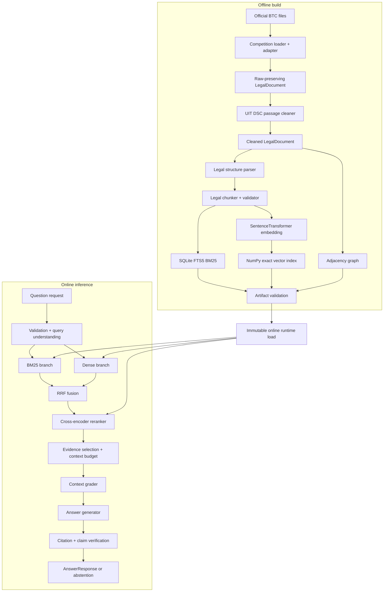

# 14. System Architecture, Technical Statistics, and I/O Reference

## 1. Mục đích

Tài liệu này là bản đồ kỹ thuật toàn hệ thống theo implementation hiện tại. Nó
trả lời ba câu hỏi:

1. hệ thống gồm những lớp và module nào;
2. mỗi phần nhận input gì và tạo output gì;
3. công nghệ, backend, model candidate, giới hạn và trạng thái hiện tại là gì.

Tài liệu mô tả **as-built architecture**, không biến phần đang chờ dữ liệu BTC
thành chức năng đã hoàn tất. Contract dữ liệu cuộc thi chi tiết nằm tại
[`13-UIT-DSC-2026-DATA-CONTRACT.md`](13-UIT-DSC-2026-DATA-CONTRACT.md).
Scorer BTC được mô tả tại
[`15-OFFICIAL-SCORING-CONTRACT.md`](15-OFFICIAL-SCORING-CONTRACT.md).

## 2. Trạng thái tổng quan

| Hạng mục | Trạng thái |
|---|---|
| Unified schemas, configuration, contracts | Đã triển khai |
| Competition loader/adapter/audit/cleaner | Đã triển khai và xác nhận trên 8.532 context thật |
| Parser, chunker, BM25, vector index | Đã triển khai và có test fixture |
| Official BTC corpus build | Đã build 330.768 chunk, BM25, vector và serving metadata |
| Hybrid RRF và reranker | Đã triển khai |
| Graph backend/retrieval | Đã triển khai generic; official graph hiện bắt buộc rỗng vì BTC chưa cung cấp relationships |
| Grounded generation, grading, verification | Đã triển khai |
| Bounded deterministic Agent | Đã triển khai, không phải autonomous/multi-agent |
| API và local UI | Đã triển khai |
| Batch, resume, submission ZIP, local scoring | Đã triển khai; public M43.1 chạy đủ 1.000 câu |
| Official scorer source contract | Đã phân tích và checksum; local parity chưa implement |
| Model registration | E5, mMARCO reranker và Qwen2.5-3B được người dùng xác nhận BTC đã duyệt |
| Public quality | METEOR 0,07862; ROUGE-L 0,16735; cần cải thiện |

## 3. Kiến trúc cấp cao



Luồng competition hoàn chỉnh:

```text
selected-contexts.zip
→ audit và unified ingestion
→ immutable artifacts
→ official question file
→ batch inference có checkpoint
→ verified internal AnswerResponse
→ answer-only renderer
→ submission.zip/submission.json
→ Codabench METEOR + ROUGE-L
```

## 4. Nguyên tắc kiến trúc

- Python `src/` layout với package import `legal_agentic_rag`.
- Raw field BTC chỉ tồn tại trong `competition/uit_dsc_2026`.
- Core giao tiếp bằng Pydantic unified schemas và `typing.Protocol`.
- Offline build và online inference tách biệt hoàn toàn.
- Artifact persisted phải có manifest, checksum, lineage và config/code identity.
- Online runtime chỉ đọc artifact tương thích, không rebuild hoặc sửa corpus.
- Backend/model cụ thể nằm sau contract, không hard-code vào domain schema.
- Competition runtime là `competition_only`, từ chối AIO/external lineage.
- API model và external data bị cấm trong competition.
- Agent chỉ điều phối tool cố định, retry tối đa 2; không tự khám phá tool.
- Evidence thiếu hoặc verification thất bại phải abstain.

## 5. Technical statistics

Số liệu được đo từ working tree ngày 2026-08-08:

| Chỉ số | Giá trị |
|---|---:|
| Project version | `0.44.5` (M44 A/B profiles and low-memory Qwen startup) |
| Minimum Python | `3.11` |
| Build backend | `setuptools` |
| Source Python files | 140 |
| Source lines | 21.378 |
| Test Python files | 101 |
| Test lines | 11.514 |
| Test functions | 398 |
| Public CLI commands | 11 |
| Fixed Agent tools | 8 |

Các con số file/line/test là snapshot, sẽ thay đổi khi repository thay đổi.

### 5.1 Runtime technology stack

| Công nghệ | Vai trò | Version constraint |
|---|---|---|
| Python | Runtime chính | `>=3.11` |
| Pydantic v2 | Schema và configuration validation | `>=2,<3` |
| NumPy | Vector matrix và exact cosine search | `>=1.26,<3` |
| Sentence Transformers | Embedding và cross-encoder integration | `==5.4.1` |
| Transformers | Local model-backed generation/verification | `>=4.51,<6` |
| FastAPI | HTTP API | `>=0.139,<1` |
| Uvicorn | ASGI server | `>=0.30,<1` |
| SQLite FTS5 | BM25-style lexical index | Python standard-library SQLite |
| Standard logging | Structured contextual logging | Python standard library |
| Pytest | Test runner | `>=8` |

PyTorch được sử dụng gián tiếp bởi Sentence Transformers/Transformers và vector
CUDA scorer, nhưng hiện không được pin trực tiếp trong `pyproject.toml`. Môi
trường tái lập cuối phải freeze đầy đủ transitive dependencies.

### 5.2 Current backend/reference implementations

| Boundary | Reference implementation | Persistence |
|---|---|---|
| BM25 | `SQLiteFTS5BM25Backend` | `index.sqlite3` + `manifest.json` |
| Embedding | `SentenceTransformerEmbeddingProvider` | Model identity trong manifest |
| Vector | `NumpyVectorBackend`, exact cosine | `vectors.npy`, `chunks.jsonl`, manifest |
| Vector metadata | SQLite serving metadata | `metadata.sqlite3` + manifest |
| Reranker | `CrossEncoderReranker` | Model tải theo pinned identity |
| Graph | `AdjacencyGraphBackend` | `graph.json` + manifest |
| Generator | Extractive hoặc local Transformers | Không persist answer model trong artifact root |
| Context grader | Rule-based | Không có artifact |
| Citation verifier | Rule/claim-based, optional local semantic model | Không có artifact |
| API/UI | FastAPI + same-origin HTML UI | Một process, một immutable runtime |

Đây là reference backend, chưa phải quyết định production cuối cùng.

### 5.3 Important default limits

| Cấu hình | Default |
|---|---:|
| Chunk max/min/overlap | `512 / 50 / 50` tokens |
| Embedding dimension | `384` |
| Embedding max sequence | `512` |
| Embedding batch | `16` |
| Retrieval `top_k` | `10` |
| Retrieval `candidate_k` | `100` |
| RRF constant | `60` |
| Graph hop | default `1`, maximum `2` |
| Reranker batch/max candidates | `8 / 100` |
| Reranker max length | `512` |
| Query variants | default maximum `3`, hard limit `5` |
| Context budget | `4096` tokens |
| Maximum evidence | `8` |
| Agent retry | maximum `2` |
| Default timeout | `30` seconds per configured operation |
| Serving question length | `4,000` characters |
| HTTP host/port | `127.0.0.1:8000` |
| API prefix/UI | `/api/v1`, `/ui` |

Các giá trị trên là typed defaults, không phải competition tuning cuối cùng.

### 5.4 Current model inventory

| Vai trò | Candidate | Revision | Trạng thái |
|---|---|---|---|
| Embedding | `intfloat/multilingual-e5-small` | `614241f622f53c4eeff9890bdc4f31cfecc418b3` | Người dùng xác nhận BTC đã duyệt; active M43 |
| Reranker | `cross-encoder/mmarco-mMiniLMv2-L12-H384-v1` | `1427fd652930e4ba29e8149678df786c240d8825` | Người dùng xác nhận BTC đã duyệt; không active M43 |
| Generator | `Qwen/Qwen2.5-3B-Instruct` | `a1d308dfcc03e09da285d49d912439a655a571e8` | Người dùng xác nhận BTC đã duyệt; active M43 |

Generator mặc định trong config là `extractive`; semantic verifier mặc định
`disabled`. Backend `openai_compatible` còn tồn tại trong generic code lịch sử,
nhưng **không được cấu hình cho cuộc thi** vì BTC cấm mọi API.

E5 + Qwen là active stack M43; reranker không được cộng như model active trong
run này. Mọi candidate mới hoặc cấu hình kích hoạt thêm model vẫn phải kiểm kê
tổng parameter dưới `4_000_000_000`. Bằng chứng BTC duyệt phải được giữ trong hồ
sơ đội; xác nhận trong tài liệu không thay thế bằng chứng gốc.

### 5.5 Active M43.1 profile và measured artifacts

| Thành phần | Giá trị thực tế |
|---|---|
| Corpus | 8.532 context, 8.512 có nội dung |
| Parser/chunker | 330.768 chunks, exact E5 maximum 512 token |
| BM25 | SQLite FTS5, 330.768 records |
| Dense | E5-small, 384 chiều, exact NumPy/Torch search |
| Fusion | RRF hybrid, `candidate_k=60`, `top_k=8` |
| Query variants | tối đa 3 |
| Reranker | tắt |
| Graph expansion | tắt; artifact zero-edge |
| Evidence/context | tối đa 5 evidence, 3.072 token |
| Generation | Qwen2.5-3B, fp16, 256 output token, temperature 0 |
| Verification | rule/claim-based; semantic model tắt |
| Agent | chỉ strategy `hybrid`, max retry 2, không query rewrite |

Serving package M43 có SHA-256
`90d4d211a20f6d3a6f894d8dd33c0f187fcf141c1bcbc3814d8dcc7e003e729c`.
Vector matrix có shape `(330768, 384)`. Public batch cuối có 1.000 unique IDs,
0 retrieval model error, 425 abstention và 33 generator model error. Đây là
measured experiment snapshot, không phải default cho mọi config hoặc cam kết
production.

## 6. Package architecture

| Package | Trách nhiệm | Không chịu trách nhiệm |
|---|---|---|
| `competition` | Raw BTC adapter, batch, submission, warm-up scoring | Retrieval/generation core |
| `schemas` | Unified Pydantic contracts | Backend implementation |
| `configuration` | Typed policy, model/backend identity, limits | Secrets và runtime side effects |
| `contracts` | `typing.Protocol` backend boundaries | Composition cụ thể |
| `offline` | Cleaning, parsing, chunking, relationship processing | Online query |
| `indexing` | BM25/vector/graph build, persist, load, search | Answer generation |
| `embeddings` | Text-to-vector provider | Vector storage |
| `retrieval` | Sparse/dense/RRF/rerank/graph orchestration | Corpus mutation |
| `reranking` | Candidate scoring | Full-corpus search |
| `generation` | Evidence selection, grading, generation, verification | Dataset loading |
| `tools` | Fixed typed wrappers và registry | Dynamic plugin discovery |
| `agent` | Bounded deterministic orchestration | Autonomous planning/training |
| `runtime` | Offline/online composition roots và artifact validation | Domain schema definition |
| `serving` | CLI, API, UI, request boundary | Direct backend access từ client |
| `evaluation` | Metrics, run reports, comparison, provenance | Official scorer equivalence claim |
| `observability` | Logging setup/context | Business decisions |
| `exceptions.py` | Domain error taxonomy | HTTP stack trace exposure |

## 7. Offline pipeline: input/output từng phần

Competition composition root:
`runtime/competition_offline.py::CompetitionOfflineBuildRuntime`.

| Phần | Input | Xử lý chính | Output |
|---|---|---|---|
| Source inspection | ZIP hoặc directory `context_*.json` | Ordered filenames + exact bytes SHA-256 | `ContextSourceIdentity` |
| Competition loader | Raw JSON object/file | UTF-8 decode, duplicate-key/path/schema checks | `CompetitionContext` records |
| Context adapter | `CompetitionContext` | Map raw boundary sang core; không suy diễn metadata | `LegalDocument` |
| Corpus audit | Context records + source identity | Count, unique ID, passage bounds, duplicate title/URL | `CompetitionCorpusAuditReport` |
| Dataset lineage | Audit + canonical source hash | Pin dataset/revision/count | `DatasetManifest` |
| Normalized/cleaned pass-through | Official `LegalDocument` | Giữ passage, không crawl URL | Normalized và cleaned document artifacts |
| Legal parser | `LegalDocument.clean_text` | Parse Phần/Chương/Mục/Điều/Khoản/Điểm | `LegalBlock`, parsing diagnostics |
| Legal chunker | Documents + blocks | Article-first, clause grouping, token fallback | `LegalChunk`, chunk diagnostics |
| Chunk validator | Blocks + chunks | Identity, hierarchy, coverage, provenance | Valid chunks hoặc structured error |
| BM25 build | Stream `LegalChunk` + source manifest | Unicode analyzer, SQLite FTS5 index | BM25 manifest + `index.sqlite3` |
| Embedding | `LegalChunk.search_text` | Prefix `passage:`, local model, normalized vector | Batches of 384-d vectors |
| Vector build | Chunks + aligned vectors + manifest | Exact float32 cosine index, resumable batches | Vector manifest + `.npy`/JSONL |
| Relationship stage | Official relationship input nếu có | Normalize only verified official relations | `LegalRelationship` artifact |
| Graph build | Documents + relationships | Directed adjacency graph | Graph manifest + `graph.json` |
| Artifact validation | Dataset + all manifests/payloads | Checksums, record counts, lineage, SQLite integrity | `BuildValidationReport` |
| Recovery state | Source hash + config hash + code version | Atomic ordered stage checkpoint | `competition_build_state.json` |

### 7.1 Actual competition build order

```text
CORPUS
  ├─ dataset manifest
  ├─ normalized documents
  ├─ cleaned documents
  ├─ audit
  ├─ empty relationships (current official assumption)
  └─ zero-edge graph
DOCUMENT_PROCESSING
  ├─ legal blocks
  └─ legal chunks
BM25
VECTOR
VALIDATION
```

Hiện `CompetitionOfflineBuildRuntime` yêu cầu official relationship artifact
rỗng và graph có `record_count = 0`. Chỉ thay đổi sau khi dữ liệu thật cung cấp
hoặc passage chứng minh quan hệ và decision được phê duyệt.

### 7.2 Expected artifact root

```text
artifact_root/
├── audit/
├── normalized_documents/
├── cleaned_documents/
├── legal_blocks/
├── legal_chunks/
├── relationships/
├── bm25/
├── vector/
├── vector_serving/
├── graph/
├── dataset_manifest.json
├── competition_build_state.json
└── build_validation.json
```

Mỗi directory artifact có manifest riêng. Mặc định không overwrite artifact cũ.

## 8. Indexing và retrieval I/O

### 8.1 Backend contracts

| Contract | Input tối thiểu | Output tối thiểu |
|---|---|---|
| `BM25Backend.build` | Iterable `LegalChunk`, source `ArtifactManifest` | BM25 `ArtifactManifest` |
| `BM25Backend.search` | `RetrievalQuery` | `RetrievalResponse` |
| `EmbeddingProvider.embed_documents` | Sequence text + batch size | Sequence vectors |
| `EmbeddingProvider.embed_query` | Query text | Một vector |
| `VectorBackend.build_persisted` | Batch factory + source/model provenance | Vector `ArtifactManifest` |
| `VectorBackend.search` | `RetrievalQuery` + query vector | `RetrievalResponse` |
| `Reranker.rerank` | Query + bounded `RetrievalHit` candidates | Reranked `RetrievalResponse` |
| `GraphBackend.build` | Documents + relationships + manifests | Graph `ArtifactManifest` |
| `GraphBackend.traverse` | Seed document IDs + hop/type limits | `GraphPathStep[]` |

### 8.2 Retrieval strategies

| Strategy | Input | Flow | Output |
|---|---|---|---|
| `bm25` | Unified query | Query planner → SQLite FTS5 | Ranked lexical hits |
| `dense` | Unified query | Query embedding → exact cosine | Ranked dense hits |
| `hybrid` | BM25 + dense branch results | Deduplicate chunk ID → RRF | Fused hits + branch contributions |
| `hybrid_rerank` | Hybrid candidate set | Cross-encoder bounded scoring | Final reranked hits |
| `graph` | Text-retrieval seed hits | Seed documents → bounded BFS → merge | Hits with graph path/hop trace |

Mọi strategy trả cùng schema `RetrievalResponse`:

```text
query
strategy
hits[]
latency_ms
warnings[]
artifact_versions{}
```

Mỗi `RetrievalHit` giữ chunk/document ID, rank, score, text, metadata và
`RetrievalTrace` gồm sparse/dense rank, raw score, RRF contribution, reranker
score, query-variant contribution và graph path khi có.

## 9. Online pipeline: input/output từng phần

Online composition root: `runtime/online.py::OnlineRuntimeFactory`.

| Phần | Input | Xử lý chính | Output |
|---|---|---|---|
| Startup validation | Config + chunk/BM25/vector/graph manifests | Dataset lineage, source hashes, model compatibility | Ready runtime hoặc fail-fast error |
| Request validation | `LegalQuestionRequest` | Blank/length/top-k/strategy checks | Valid public request |
| Query creation | Public request + defaults | UUID, NFC, whitespace normalize, limits | `RetrievalQuery` |
| Query understanding | Unified query | Intent, document/Điều/Khoản/Điểm/year cues | Query + `QueryAnalysis` |
| Multi-query variants | Query analysis | Deterministic variants, không thêm external knowledge | `QueryVariant[]` |
| Strategy routing | Query + config + attempt history | Chọn fixed strategy trong allowlist | Retrieval tool invocation |
| Fixed retrieval | Query + loaded artifacts | BM25/dense/RRF/rerank/graph | `RetrievalResponse` |
| Evidence selection | Retrieval hits | Applicability, dedupe, ranking, token/evidence limit | `ContextBuildResult` + `Evidence[]` |
| Context grading | Query + evidence | Relevance/coverage/consistency/applicability | `ContextGrade` |
| Generation | Query + sufficient evidence | Extractive hoặc local Transformers | Draft/final `AnswerResponse` |
| Citation verification | Answer + evidence | ID allowlist, citation mapping | `CitationVerificationResult` |
| Claim grounding | Answer claims + evidence | Lexical/numeric/negation checks | Per-claim verification |
| Semantic verification | Deterministically valid claims | Optional local Transformers model | Semantic assessments |
| Response packaging | Verified answer/state/trace | Citations, warning, abstention | Public `AnswerResponse` |

### 9.1 Main online schemas

```text
LegalQuestionRequest
→ RetrievalQuery
→ RetrievalResponse
→ Evidence[]
→ ContextGrade
→ AnswerResponse
→ CitationVerificationResult
→ AgentRunResult
```

`AnswerResponse` luôn có:

```text
question
answer
citations[]
insufficient_evidence
warnings[]
retrieval_strategy
trace_id
metadata{}
```

Nếu context không đủ, backend lỗi, timeout hoặc verification thất bại, hệ thống
trả answer abstention với `insufficient_evidence = true`; không đoán câu trả lời.

## 10. Generation and verification contracts

| Contract | Input | Output | Không chịu trách nhiệm |
|---|---|---|---|
| `ContextGrader.grade` | Query + selected evidence | `ContextGrade` | Retrieval/index build |
| `AnswerGenerator.generate` | Query + evidence + strategy + trace ID | Grounded answer hoặc abstention | Tự tìm external evidence |
| `CitationVerifier.verify` | Answer + exact selected evidence | `CitationVerificationResult` | Sửa corpus hoặc tạo citation mới |

Generation chỉ được dùng evidence đã chọn. Model-backed draft phải khai báo
evidence IDs; hệ thống tự dựng citation từ trusted evidence thay vì tin metadata
do model sinh. Claim verifier kiểm tra coverage, số, phủ định và evidence marker;
semantic verifier chỉ chạy sau hard checks.

## 11. Tools and Agent

Registry có đúng 8 tool, không dynamic discovery:

1. BM25 search;
2. dense search;
3. hybrid search;
4. hybrid-rerank search;
5. graph search;
6. context grading;
7. answer generation;
8. citation verification.

Agent input là `RetrievalQuery`; output là `AgentRunResult`. Workflow:

```text
analyze query
→ choose an allowed retrieval strategy
→ retrieve
→ select and grade evidence
→ retry/rewrite if bounded policy allows
→ generate
→ verify
→ verified answer or abstention
```

Default strategy order là `hybrid_rerank → graph → hybrid`, retry tối đa 2.
Agent không tải dữ liệu, build index, gọi web/API, sửa config hoặc tự thêm tool.

## 12. Serving I/O

FastAPI lifespan load đúng một immutable `OnlineRuntime` khi process khởi động.

| Route | Input | Output |
|---|---|---|
| `GET /api/v1/health` | Không có body | Dataset/artifact identity, version, tool count |
| `POST /api/v1/retrieve` | `LegalQuestionRequest` | `RetrievalResponse` |
| `POST /api/v1/answer` | `LegalQuestionRequest` | Verified `AnswerResponse` |
| `GET /ui` | Browser | Same-origin diagnostic HTML UI |
| `GET /docs` | Browser | OpenAPI docs khi enabled |

Public request:

```json
{
  "question": "Câu hỏi pháp luật bằng tiếng Việt",
  "filters": {},
  "top_k": 10,
  "candidate_k": 100,
  "requested_strategy": "hybrid_rerank"
}
```

HTTP errors dùng sanitized envelope `ApiErrorResponse`, không trả secret hoặc
raw stack trace.

## 13. Competition batch and submission I/O

### 13.1 Official question loader

Input:

```text
question_id -> {question, answer?}
```

Output: ordered `CompetitionQuestion[]`. Gold/reference answer không được truyền
vào answerer khi inference.

### 13.2 Batch inference

Input: question file + application config + ready online runtime.

Output directory:

```text
batch_output/
├── results.jsonl
├── batch_state.json
└── manifest.json
```

- `results.jsonl`: `question_id` + full internal `AnswerResponse`.
- `batch_state.json`: atomic checkpoint để resume.
- `manifest.json`: chỉ xuất hiện khi đủ toàn bộ ID đúng source order.

Identity gồm question-source SHA-256, config hash, code version và output hash.

### 13.3 Submission formatter

Input: official question source + completed compatible batch.

Output:

```text
submission.zip
└── submission.json
```

`submission.json` là object thực tế Codabench yêu cầu:

```json
{
  "question_id": {
    "answer": "Câu trả lời văn xuôi"
  }
}
```

Formatter loại internal citation marker đã xác minh, trace, warning và metadata;
kiểm tra đầy đủ/duy nhất/order của ID và tạo checksum archive.

## 14. Evaluation I/O

| Phần | Input | Output |
|---|---|---|
| Retrieval evaluator | Case có explicit relevance grades + response | Recall@K, Precision@K, MRR, NDCG@K |
| Generation evaluator | Reference answer/citation/abstention label nếu có | Exact match, diagnostic METEOR/ROUGE-L, citation, abstention metrics |
| Evaluation runner | Benchmark + runtime + config | Immutable per-case/aggregate report |
| Comparison | Ít nhất 2 compatible reports + objectives | Eligibility, regression, Pareto comparison |
| Warm-up scorer | `warmup.json` + `submission.zip` | Content-free score report + checksums |

Local METEOR dùng exact-token deterministic matching; local ROUGE-L dùng token
LCS F1. Chúng phục vụ diagnostic và không parity với scorer BTC. Source chính
thức dùng whitespace NLTK METEOR, vendored ASCII-only ROUGE tokenizer và macro
mean; exact NLTK/WordNet versions vẫn chưa được ZIP pin.

## 15. CLI surface

| Command | Input chính | Output chính |
|---|---|---|
| `legal-rag-build-competition` | Config + official context source | Complete/resumed artifact set |
| `legal-rag-batch` | Config + question file + output dir | Resumable internal predictions |
| `legal-rag-submit` | Questions + completed batch | `submission.zip` |
| `legal-rag-score-warmup` | References + submission | Warm-up diagnostic report |
| `legal-rag-prepare-dev` | Official train + holdout questions | Leakage-aware local split |
| `legal-rag-diagnose-retrieval` | Online config + official questions | Content-free non-gold retrieval report |
| `legal-rag-validate` | Config/artifact root | Build validation report |
| `legal-rag-prepare-serving` | Valid artifacts | Serving metadata artifact |
| `legal-rag-serve` | Application config | API/UI process |
| `legal-rag-evaluate` | Config + benchmark | Evaluation report |
| `legal-rag-compare` | Comparison config | Candidate comparison report |

## 16. Cross-cutting architecture

### Configuration

`ApplicationConfig` ghép `artifacts`, `offline`, `online`, `competition`,
`build_validation`, `logging`, `serving`, `evaluation`. Pydantic cấm unknown
fields và kiểm tra các giới hạn chéo như `candidate_k`, reranker và serving.

### Observability

Standard logging giữ timestamp, level, module và contextual fields như trace ID,
query ID, document/chunk ID, strategy, latency và error type. Production workflow
không dùng `print`.

### Exceptions

Các nhóm lỗi gồm configuration, dataset schema/data validation, artifact
compatibility, backend initialization, retrieval, model, timeout, external
service và invalid user input. Serving map chúng sang lỗi HTTP đã sanitize.

### Security and compliance

- Không commit data, model weights, indexes, logs, secrets hoặc submission thật.
- Không external corpus, API, crawler hoặc synthetic augmentation.
- Model phải local-controllable, license hợp lệ và đăng ký BTC.
- Tổng parameter stack phải dưới 4B; quantization/LoRA không giảm cách tính này.
- Exact code/config/data/model identities phải đủ để BTC tái lập.

## 17. Known gaps and next gates

1. M43 official score thấp: METEOR `0.07862292376534387`, ROUGE-L
   `0.16735433212043324`.
2. 425/1.000 response abstain; 384 citation verification fail; 33 generator
   model error.
3. Mọi câu đều chạm context budget; prediction ngắn hơn reference train rất
   nhiều.
4. Approved reranker chưa active trong M43; fusion/top-k/context chưa có ablation
   trên leakage-safe dev.
5. Official graph zero-edge; không được kỳ vọng graph cải thiện retrieval khi
   chưa có relationship evidence hợp lệ.
6. Chưa có official relevance labels nên không được tuyên bố retrieval recall
   hoặc tự tạo synthetic hard negative.
7. Warm-up/train/public có overlap; train/dev strategy phải chống leakage.
8. Chưa biết GPU/RAM/disk/time/network của môi trường chấm cuối.
9. Exact NLTK/WordNet resource versions chưa được khóa; local scorer cần golden
   parity tests.
10. PyTorch/transitive dependency freeze và final reproduction image chưa chốt;
    P100 từng tạo batch lỗi do incompatible CUDA capability.

Phân tích đầy đủ nằm tại `16-M43-BASELINE-POSTMORTEM.md`; workstream và tiêu chí
nghiệm thu nằm tại `17-TEAM-IMPROVEMENT-BACKLOG.md`.

## 18. Definition of one successful run

Một run được coi là hợp lệ khi:

1. dữ liệu có official checksum và adapter/audit pass;
2. artifacts build hoàn chỉnh, immutable và cùng lineage;
3. online runtime load đúng manifests/model identity;
4. mọi question có đúng một verified answer hoặc explicit abstention;
5. batch manifest chứng minh đủ ID và đúng source order;
6. submission ZIP chỉ chứa đúng `submission.json`;
7. model stack tuân thủ license, đăng ký và tổng tham số dưới 4B;
8. config, code commit, model revision và output checksums được lưu;
9. README tái lập được toàn bộ quá trình mà không dùng dữ liệu/API bị cấm.
