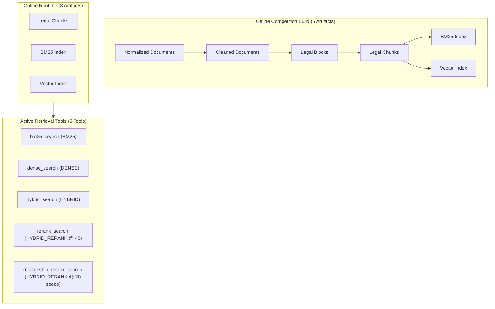

# Phase B1B: Structural Competition Graph Removal and Post-Change Equivalence Verification

---

## 1. Executive Summary and Status

- **Status**: `B1B IMPLEMENTATION COMPLETE; POST-CHANGE EQUIVALENCE VERIFICATION PENDING`
- **Package Version**: `0.50.7`
- **Scientific Authorization**: Phase B1A.2 Experiment Verdict **`GRAPH_REDUNDANCY_PROVEN`**
  - Canonical Run Archive SHA-256: `51ed1d8ba99690973f16ff023300b060d6b03e60d905efe6498325626484e39a`
  - Canonical Case Count: 22 relationship queries
  - Seed Match: 22/22 (100.0%)
  - Final Top-8 Match (G vs S20): 22/22 (100.0%)
  - Score Tolerance: Absolute difference $\le 10^{-6}$ for all 22 cases
  - Diagnostic H40 Divergence: 17/22 cases differed, confirming H40 is non-equivalent and must remain a separate second route.

Phase B1B eliminates the redundant zero-edge graph traversal overhead, runtime graph dependencies, and offline relationship/graph artifact builds from the active UIT DSC competition pipeline while preserving exact S20 retrieval behavior.

---

## 2. Structural Architecture Changes



### 2.1 Tool Surface Changes
- **Removed**: `ToolName.GRAPH_SEARCH` (`"graph_search"`) from active online agent capabilities and public descriptors.
- **Added**: `ToolName.RELATIONSHIP_RERANK_SEARCH` (`"relationship_rerank_search"`).
- **Public Strategy Preservation**: `relationship_rerank_search` emits `RetrievalStrategy.HYBRID_RERANK`. No new public strategy enum was added.

### 2.2 Relationship Strategy Routing
When `QueryAnalysis.intent == QueryIntent.RELATIONSHIP`:
1. **Attempt 1**: `RetrievalRoute(RetrievalStrategy.HYBRID_RERANK, ToolName.RELATIONSHIP_RERANK_SEARCH)`
   - Executes `RelationshipSeedRerankingRetriever` with branch candidate depth 40, hybrid fusion limit $\le 20$, cross-encoder rerank limit $\le 20$, final top 8.
2. **Attempt 2**: `RetrievalRoute(RetrievalStrategy.HYBRID_RERANK, ToolName.RERANK_SEARCH)`
   - Executes standard `RerankingRetriever` (H40) with branch candidate depth 40, hybrid candidate pool 40, cross-encoder rerank limit 40, final top 8.
3. **Attempt 3**: `RetrievalRoute(RetrievalStrategy.HYBRID, ToolName.HYBRID_SEARCH)`
   - Executes direct multi-query reciprocal rank fusion hybrid search.

The strategy router deduplicates by `RetrievalRoute` (`(strategy, tool_name)` tuple), preserving both distinct `HYBRID_RERANK` tool invocations.

### 2.3 Online Artifact Set
The online runtime artifact manifest set contains exactly **3 artifacts**:
- `legal_chunks`
- `bm25_index`
- `vector_index`

The runtime starts cleanly and fails closed if any of these 3 are missing or incompatible. Absence of `graph/` or `relationships/` does not block startup.

### 2.4 Generic Graph Retention (`KEEP_GENERIC_ONLY`)
Generic graph capabilities remain preserved outside the competition path for future multi-corpus support:
- `src/legal_agentic_rag/contracts/graph_backend.py`
- `src/legal_agentic_rag/indexing/graph/`
- `src/legal_agentic_rag/retrieval/graph.py` (`GraphExpandedRetriever`)
- Generic unit/integration test suites.

---

## 3. Kaggle Post-Change Equivalence Verification Protocol (Cells B1B-K1 to B1B-K7)

### Cell B1B-K1 — Environment & Commit Verification

```bash
%%bash
set -euo pipefail

cd /kaggle/working

# 1. Clean previous checkout
rm -rf legal-agentic-rag

# 2. Clone repository
git clone https://github.com/Chef221/legal-agentic-rag.git
cd legal-agentic-rag

# 3. Pin reviewed commit (set by reviewer)
REVIEWED_COMMIT_SHA="PLACEHOLDER_REVIEWED_COMMIT_SHA"

if [ "$REVIEWED_COMMIT_SHA" != "PLACEHOLDER_REVIEWED_COMMIT_SHA" ]; then
    git checkout "$REVIEWED_COMMIT_SHA"
fi

ACTUAL_COMMIT_SHA="$(git rev-parse HEAD)"
echo "Verified Execution Commit: $ACTUAL_COMMIT_SHA"
if [ "$REVIEWED_COMMIT_SHA" != "PLACEHOLDER_REVIEWED_COMMIT_SHA" ]; then
    test "$ACTUAL_COMMIT_SHA" = "$REVIEWED_COMMIT_SHA"
fi

# 4. Uninstall incompatible torchao if present and install exact B1A.2 environment recipe
pip uninstall -y torchao || true

pip install --no-cache-dir \
  "transformers==4.51.3" \
  "sentence-transformers==5.4.1" \
  "accelerate==1.6.0" \
  "nltk==3.7"

pip install --no-deps -e .

python3 -c "
import legal_agentic_rag
import torch
import transformers
import sentence_transformers
print('Package version:', legal_agentic_rag.__version__)
assert legal_agentic_rag.__version__ == '0.50.7', f'Expected 0.50.7, got {legal_agentic_rag.__version__}'
print('Torch version:', torch.__version__)
print('CUDA available:', torch.cuda.is_available())
print('CUDA runtime version:', torch.version.cuda)
print('Device count:', torch.cuda.device_count())
if torch.cuda.is_available():
    print('GPU device name:', torch.cuda.get_device_name(0))
assert torch.cuda.is_available(), 'CUDA is required for embedding and reranking'
print('Transformers version:', transformers.__version__)
print('Sentence-Transformers version:', sentence_transformers.__version__)
"
```

---

### Cell B1B-K2 — Identity-Based Input & Evidence Discovery

```python
import hashlib
import json
import zipfile
from pathlib import Path

CANONICAL_DEV_SHA = "8678791de5194cbac073732a59541cbba8336aad74ff384410e2025c92bd0bd8"
CANONICAL_B1A2_RESULTS_SHA = "51ed1d8ba99690973f16ff023300b060d6b03e60d905efe6498325626484e39a"

# 1. Discover canonical development.json uniquely
dev_candidates = list(Path("/kaggle/input").rglob("development.json"))
matching_devs = []
for cand in dev_candidates:
    if cand.is_file() and hashlib.sha256(cand.read_bytes()).hexdigest() == CANONICAL_DEV_SHA:
        matching_devs.append(cand)

assert len(matching_devs) == 1, (
    f"Expected exactly 1 canonical development.json matching SHA {CANONICAL_DEV_SHA}, "
    f"found {len(matching_devs)}: {matching_devs}"
)
dev_path = matching_devs[0]
print(f"Found unique canonical development.json at: {dev_path}")

# 2. Discover serving artifact root uniquely satisfying full corpus validation
val_candidates = list(Path("/kaggle/input").rglob("build_validation_full_corpus.json"))
if not val_candidates:
    val_candidates = list(Path("/kaggle/input").rglob("build_validation.json"))

valid_serving_roots = []
for val_file in val_candidates:
    root = val_file.parent
    if not all((root / sub).is_dir() for sub in ["legal_chunks", "bm25", "vector"]):
        continue
    try:
        report = json.loads(val_file.read_text(encoding="utf-8"))
    except Exception:
        continue
    dataset_manifest = report.get("dataset_manifest", {})
    if (
        report.get("is_valid") is True
        and report.get("is_full_corpus") is True
        and isinstance(dataset_manifest, dict)
        and dataset_manifest.get("dataset_name") == "uit-dsc-2026-task2-selected-contexts"
    ):
        valid_serving_roots.append(root)

assert len(valid_serving_roots) == 1, (
    f"Expected exactly 1 valid serving artifact root matching full corpus validation contract, "
    f"found {len(valid_serving_roots)}: {valid_serving_roots}"
)
serving_root = valid_serving_roots[0]
print(f"Found unique validated serving artifact root at: {serving_root}")

# 3. Discover Phase B1A.2 baseline evidence directory or zip uniquely by canonical results SHA
matching_b1a2 = []
for p in Path("/kaggle/input").rglob("*"):
    if p.is_file() and p.name == "phase_b1a2_retrieval_results.jsonl":
        if hashlib.sha256(p.read_bytes()).hexdigest() == CANONICAL_B1A2_RESULTS_SHA:
            matching_b1a2.append(p.parents[1] if p.parent.name == "results" else p.parent)
    elif p.is_file() and p.name.endswith(".zip"):
        try:
            with zipfile.ZipFile(p, "r") as zf:
                for member in zf.namelist():
                    if member.endswith("phase_b1a2_retrieval_results.jsonl"):
                        data = zf.read(member)
                        if hashlib.sha256(data).hexdigest() == CANONICAL_B1A2_RESULTS_SHA:
                            matching_b1a2.append(p)
                            break
        except Exception:
            continue

matching_b1a2 = list(dict.fromkeys(matching_b1a2))
assert len(matching_b1a2) == 1, (
    f"Expected exactly 1 verified B1A.2 baseline evidence root/zip with canonical results SHA {CANONICAL_B1A2_RESULTS_SHA}, "
    f"found {len(matching_b1a2)}: {matching_b1a2}"
)
b1a2_evidence_root = matching_b1a2[0]
print(f"Found unique verified B1A.2 baseline evidence at: {b1a2_evidence_root}")
```

---

### Cell B1B-K3 — Create Graphless Staging Root

```python
import os
import shutil
from pathlib import Path

work_dir = Path("/kaggle/working")
staging_root = work_dir / "graphless_staging_root"

# Create graphless staging root (expose valid components only)
staging_root.mkdir(parents=True, exist_ok=True)
for item in serving_root.iterdir():
    if item.name in ("graph", "relationships"):
        continue
    dest = staging_root / item.name
    if not dest.exists():
        try:
            os.symlink(item.resolve(), dest, target_is_directory=item.is_dir())
        except OSError:
            if item.is_dir():
                shutil.copytree(item, dest)
            else:
                shutil.copy2(item, dest)

assert not (staging_root / "graph").exists(), "Staging root illegally contains graph directory"
assert not (staging_root / "relationships").exists(), "Staging root illegally contains relationships directory"
print(f"Created clean graphless staging root at: {staging_root}")
print(f"Staging root items: {[p.name for p in staging_root.iterdir()]}")
```

---

### Cell B1B-K4 — Runtime Configuration Freeze

```python
import json
from pathlib import Path
from legal_agentic_rag.configuration import ApplicationConfig

base_example = Path("legal-agentic-rag/configs/phase-a-current-system-census-kaggle.example.json")
cfg = json.loads(base_example.read_text(encoding="utf-8"))

# Point artifacts strictly to graphless staging root
cfg["artifacts"]["root_path"] = str(staging_root)

# Set retrieval parameters
cfg["online"]["retrieval"]["top_k"] = 8
cfg["online"]["retrieval"]["candidate_k"] = 40
cfg["online"]["retrieval"]["relationship_rerank_fusion_k"] = 20

# Set device to single GPU ("cuda") for retrieval components
cfg["online"]["vector_runtime"]["search_device"] = "cuda"
cfg["offline"]["embedding"]["device"] = "cuda"
cfg["online"]["reranker"]["device"] = "cuda"

# Strictly validate configuration through ApplicationConfig schema
app_cfg = ApplicationConfig.model_validate(cfg)
assert app_cfg.online.retrieval.top_k == 8
assert app_cfg.online.retrieval.candidate_k == 40
assert app_cfg.online.retrieval.relationship_rerank_fusion_k == 20
assert app_cfg.online.vector_runtime.search_device == "cuda"

runtime_cfg_path = work_dir / "runtime_config_b1b.json"
runtime_cfg_path.write_text(json.dumps(cfg, indent=2), encoding="utf-8")
print(f"B1B Runtime configuration validated and written to: {runtime_cfg_path}")
```

---

### Cell B1B-K5 — Retrieval-Only Execution & Protocol Verification

```python
import subprocess
import json
from pathlib import Path

output_dir = work_dir / "b1b_verification"
output_dir.mkdir(parents=True, exist_ok=True)

cmd = [
    "python", "legal-agentic-rag/scripts/phase_b1b_graphless_equivalence.py",
    "--config", str(runtime_cfg_path),
    "--manifest", "legal-agentic-rag/configs/phase-b1a-graph-routing-cases.json",
    "--questions", str(dev_path),
    "--baseline-evidence-dir", str(b1a2_evidence_root),
    "--output-dir", str(output_dir),
    "--staging-root", str(staging_root),
]

print("Executing Phase B1B Verification Protocol...")
res = subprocess.run(cmd, capture_output=False, text=True, check=True)
```

---

### Cell B1B-K6 — Mechanical Decision & Verdict Verification

```python
import json
from pathlib import Path

report_path = output_dir / "results" / "phase_b1b_equivalence_report.json"
decision_path = output_dir / "results" / "phase_b1b_decision_report.json"

report = json.loads(report_path.read_text(encoding="utf-8"))
decision = json.loads(decision_path.read_text(encoding="utf-8"))

print("\n" + "=" * 60)
print(f"PHASE B1B VERIFICATION VERDICT: {decision['verdict']}")
print("=" * 60)
print(f"B1B Verified:             {decision['b1b_verified']}")
print(f"Exact Matches:            {decision['summary']['exact_matches']} / 22")
print(f"Score Tolerance Passes:   {decision['summary']['score_passes']} / 22")
print(f"Branch Depth 40 Passes:   {decision['summary']['branch_depth_passes']} / 22")
print(f"Candidate Query Passes:   {decision['summary']['candidate_query_passes']} / 22")
print(f"Fusion Limit Passes:      {decision['summary']['fusion_limit_passes']} / 22")
print(f"Final Top-K Passes:       {decision['summary']['final_topk_passes']} / 22")
print(f"Route Plan Passes:        {decision['summary']['route_plan_passes']} / 22")

print("\nEquivalence Summary:")
for k, v in report.get("equivalence_summary", {}).items():
    print(f"  {k}: {v}")

print("\nAggregate Protocol Counts:")
for k, v in report.get("aggregate_protocol_counts", {}).items():
    print(f"  {k}: {v}")

print("\nReasons:")
for r in decision.get("reasons", []):
    print(f"  - {r}")
print("=" * 60)

assert decision["verdict"] == "B1B_EQUIVALENCE_PASS", f"Verification failed with verdict: {decision['verdict']}"
```

---

### Cell B1B-K7 — Evidence Packaging & Download

```python
import hashlib
from pathlib import Path

zip_path = output_dir / "phase-b1b-graphless-equivalence-evidence.zip"
assert zip_path.is_file(), f"Expected evidence zip at {zip_path}"

zip_bytes = zip_path.read_bytes()
zip_sha = hashlib.sha256(zip_bytes).hexdigest()
zip_size = len(zip_bytes)

print("\n" + "=" * 60)
print("PHASE B1B EVIDENCE PACKAGE READY")
print("=" * 60)
print("ZIP Path:      ", zip_path)
print("ZIP SHA-256:   ", zip_sha)
print("ZIP Size Bytes:", zip_size)
print("=" * 60)
print(">>> DOWNLOAD phase-b1b-graphless-equivalence-evidence.zip BEFORE ENDING SESSION <<<")
```
