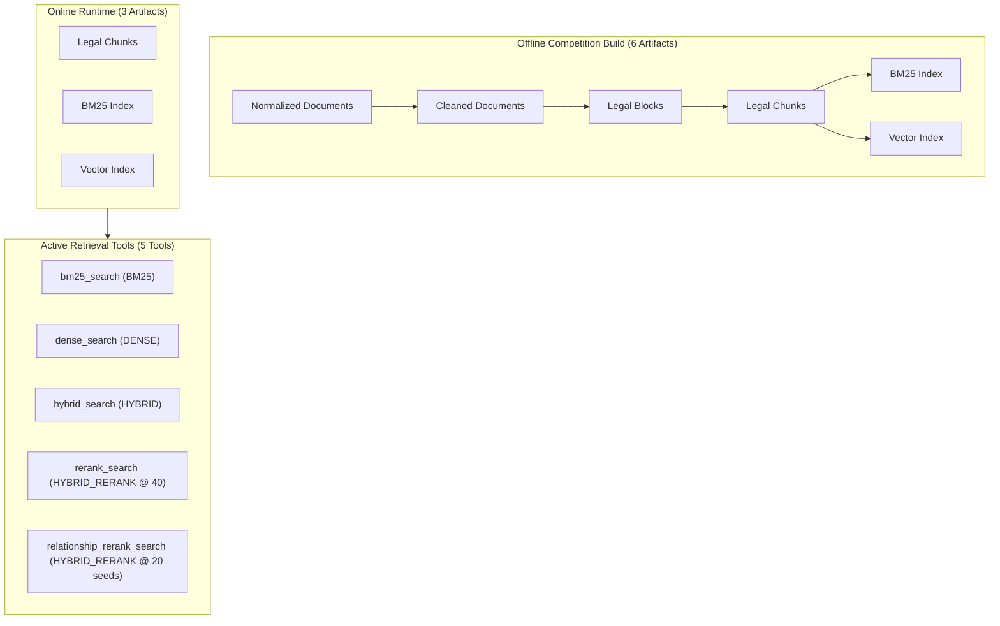

# Phase B1B: Structural Competition Graph Removal

---

## 1. Executive Summary and Status

- **Status**: `B1B IMPLEMENTATION COMPLETE; POST-CHANGE EQUIVALENCE VERIFICATION PENDING`
- **Package Version**: `0.50.7`
- **Scientific Authorization**: Phase B1A.2 Experiment Verdict **`GRAPH_REDUNDANCY_PROVEN`**
  - Canonical Run Archive SHA-256: `51ed1d8ba99690973f16ff023300b060d6b03e60d905efe6498325626484e39a`
  - Canonical Case Count: 22 relationship queries
  - Seed Match: 22/22 (100.0%)
  - Final Top-8 Match (G vs S20): 22/22 (100.0%)
  - Score Tolerance: Absolute difference $\le 10^{-6}$ for all 22 cases
  - Diagnostic H40 Divergence: 17/22 cases differed, confirming H40 is non-equivalent and must remain a separate second route.

Phase B1B eliminates the redundant zero-edge graph traversal overhead, runtime graph dependencies, and offline relationship/graph artifact builds from the active UIT DSC competition pipeline while preserving exact S20 retrieval behavior.

---

## 2. Structural Architecture Changes



### 2.1 Tool Surface Changes
- **Removed**: `ToolName.GRAPH_SEARCH` (`"graph_search"`) from the online agent tool registry.
- **Added**: `ToolName.RELATIONSHIP_RERANK_SEARCH` (`"relationship_rerank_search"`).
- **Public Strategy Preservation**: `relationship_rerank_search` emits `RetrievalStrategy.HYBRID_RERANK`. No new public strategy enum was added.

### 2.2 Relationship Strategy Routing
When `QueryAnalysis.intent == QueryIntent.RELATIONSHIP`:
1. **Attempt 1**: `RetrievalRoute(RetrievalStrategy.HYBRID_RERANK, ToolName.RELATIONSHIP_RERANK_SEARCH)`
   - Executes `RelationshipSeedRerankingRetriever` with branch candidate depth 40, hybrid fusion limit $\le 20$, cross-encoder rerank limit $\le 20$, final top 8.
2. **Attempt 2**: `RetrievalRoute(RetrievalStrategy.HYBRID_RERANK, ToolName.RERANK_SEARCH)`
   - Executes standard `RerankingRetriever` (H40) with branch candidate depth 40, hybrid candidate pool 40, cross-encoder rerank limit 40, final top 8.
3. **Attempt 3**: `RetrievalRoute(RetrievalStrategy.HYBRID, ToolName.HYBRID_SEARCH)`
   - Executes direct multi-query reciprocal rank fusion hybrid search.

The strategy router deduplicates by `RetrievalRoute` (`(strategy, tool_name)` tuple), preserving both distinct `HYBRID_RERANK` tool invocations.

### 2.3 Online Artifact Set
The online runtime artifact manifest set contains exactly **3 artifacts**:
- `legal_chunks`
- `bm25_index`
- `vector_index`

The runtime starts cleanly and fails closed if any of these 3 are missing or incompatible. Absence of `graph/` or `relationships/` does not block startup.

### 2.4 Generic Graph Retention (`KEEP_GENERIC_ONLY`)
Generic graph capabilities remain preserved outside the competition path for future multi-corpus support:
- `src/legal_agentic_rag/contracts/graph_backend.py`
- `src/legal_agentic_rag/indexing/graph/`
- `src/legal_agentic_rag/retrieval/graph.py` (`GraphExpandedRetriever`)
- Generic unit/integration test suites.

---

## 3. Kaggle Post-Change Equivalence Runbook

### Cell 1: Environment and Git Commit Verification
```bash
%%bash
set -euo pipefail

cd /kaggle/working/legal-agentic-rag

echo "=== Git Working Tree Status ==="
git status --short
git branch --show-current
ACTUAL_COMMIT_SHA="$(git rev-parse HEAD)"
echo "Verified Execution Commit: $ACTUAL_COMMIT_SHA"

echo "=== Python Package Verification ==="
python3 -c "import legal_agentic_rag; print('Version:', legal_agentic_rag.__version__)"
```

### Cell 2: Execute Post-Change Equivalence Verification Protocol
```bash
%%bash
set -euo pipefail

cd /kaggle/working/legal-agentic-rag

python3 scripts/phase_b1b_graphless_equivalence.py \
  --config configs/phase-a-current-system-census-kaggle.json \
  --questions data/raw/public-official.json \
  --output-dir artifacts/b1b_verification \
  --expected-cases 22
```

### Cell 3: Package Evidence and Generate Canonical Checksum
```bash
%%bash
set -euo pipefail

cd /kaggle/working/legal-agentic-rag/artifacts/b1b_verification

echo "=== Verification Report Summary ==="
cat phase_b1b_verification_report.json

echo "=== Packaging Evidence ZIP ==="
zip -q -r phase_b1b_verification_evidence.zip .

sha256sum phase_b1b_verification_evidence.zip
```
