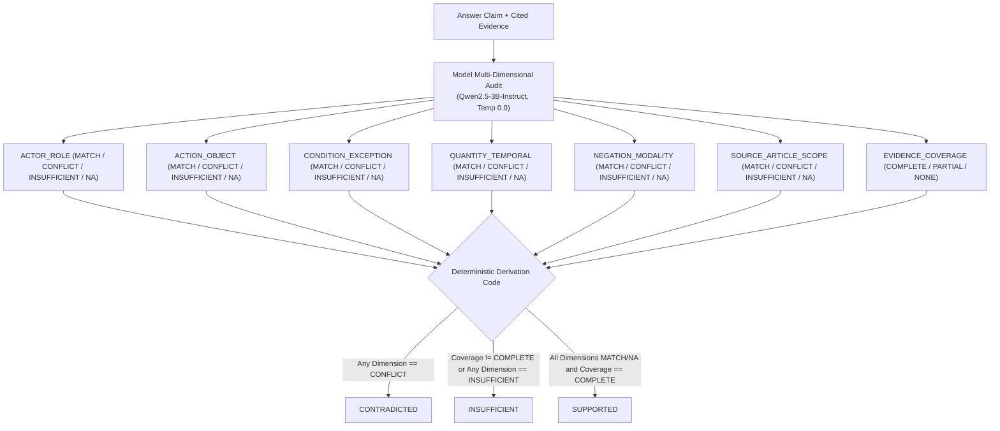

# 27 — Priority B: Verification-Correctness Forensic Audit

## 1. Executive Summary & Audit State

- **Frontier**: Priority B — Verification-Correctness Audit
- **Milestone Task**: B-FORENSIC-0 (Materialization) & B-FORENSIC-1A (Human Labels Freeze v1)
- **Status**: `HUMAN_FORENSIC_LABELS_FROZEN`
- **Production Code Changes**: NONE (`src/` untouched)
- **Model / Verifier Status**:
  - `ModelBackedCitationVerifier` remains DISABLED (`semantic_verification.enabled = false`).
  - Production `RuleBasedCitationVerifier` behavior is UNCHANGED.
  - S20 remains the active production configuration; H40 remains UNPROMOTED.
- **Human Review Package**:
  - Source Review Archive: `verification-forensic-review-packets.zip` (SHA-256 `996909f83c5e3e7d092323153fe780e713509022e64b7eab6135e64ebc2c379a`, `42,826 bytes`)
  - Frozen Label Artifact JSON: `verification-human-forensic-labels-v1.json` (SHA-256 `bad739b6d4faff74d028c9f18594564c5d0bb58babde9a6498b298ec4fee7733`, `11,849 bytes`)
  - Frozen Label Artifact ZIP: `verification-human-forensic-labels-v1.zip` (SHA-256 `25c23b80fb94a59976ccd821944355ff80aa60c7360e32a3dd8dea19dae12cbb`, `3,118 bytes`)

---

## 2. Frozen Historical Evidence Provenance

The forensic materializer operates strictly on frozen historical data without executing any live retrieval, reranking, or generative models.

### 2.1 External B1A Evidence Source
- **Archive Filename**: `phase-b1a-graph-routing-ablation-evidence.zip`
- **Observed Archive Size**: `42,993 bytes`
- **Observed Archive SHA-256**:
  `b88ccce928b4cecfc9239d490c59f91405834c5a3199f917d757c5735b1d6631`
- **Archive Member Validation (12/12 Verified)**:
  - `configs/phase-b1a-graph-routing-cases.json`: `b1efe824f320d9323af462869fd8842ef8544fa14d5f81ae35decca99e1ee99f`
  - `evidence/materialized_questions_identity.json`: `abad62cb31dc24bc40213ada580f8b464bfe2f98d1340d3820fd10de338ebcd3`
  - `configs/base_runtime_config.json`: `03a32009c0dc9a68ac93538710ec741b7a7e68a8ef9e160116ecc6bcb76d64fc`
  - `configs/candidate_runtime_config.json`: `27a490b947336a2f3aa0c34e9f7a19494be28193f10e5934c5909930fea7f99a`
  - `results/phase_b1a_paired_report.json`: `ed7b5129539a4f31b4f8b9153ef8060d75d58cebee1d7932b346d63b0dc1e0e7`
  - `results/phase_b1a_decision_report.json`: `6fce0e2daf6af1a50fdc1ed41bba271b99c7f6844e73edd1f3f52babdd365c5e`
  - `base_batch/manifest.json`: `72cb07ae18d9539357e693b0bd4385565980b9d22b5cac054cb7d3a0a0012406`
  - `candidate_batch/manifest.json`: `c64baf71ff13ccb2d864e84e875b06bdeb204dd636a45ad25ba6b3bed2499908`
  - `base_batch/results.jsonl`: `c72dc38f37945831095c71ba4b0f24f328de2e01dc4f7ecac6e527b997dc3cac`
  - `candidate_batch/results.jsonl`: `420d2297d529c3d8c246de499111840d4a4a98b010bd95e42639b7ba9f3fb6ad`
  - `base_batch/batch_state.json`: `af15d1676144570ea75c9183119ea6c6890aed062554db516c0a3ddb642cb159`
  - `candidate_batch/batch_state.json`: `11054fe5a9568da70f4e3f694185b846a8097eb90e37233825db1a02635ae219`

### 2.2 Historical Arms Identity
- **BASE Batch (`base_batch`)**:
  - `record_count`: 22
  - `code_version`: `0.50.6`
  - `question_source_sha256`: `f5d681c447a2bb964de90298207af0363c76b3546bfa027603d7fa98322a3ce3`
  - `records_sha256`: `c72dc38f37945831095c71ba4b0f24f328de2e01dc4f7ecac6e527b997dc3cac` (Exact match)
- **CANDIDATE Batch (`candidate_batch`)**:
  - `record_count`: 22
  - `code_version`: `0.50.6`
  - `question_source_sha256`: `f5d681c447a2bb964de90298207af0363c76b3546bfa027603d7fa98322a3ce3`
  - `records_sha256`: `420d2297d529c3d8c246de499111840d4a4a98b010bd95e42639b7ba9f3fb6ad` (Exact match)

### 2.3 Benchmark & Serving Artifact Provenance
- **Canonical Development Benchmark**:
  - Filename: `development.json`
  - Record Count: 991
  - SHA-256: `8678791de5194cbac073732a59541cbba8336aad74ff384410e2025c92bd0bd8` (Exact match)
- **Canonical Serving Artifact Root**:
  - Artifact Directory: `uit-dsc-2026-task2-v0400/legal_chunks`
  - `artifact_type`: `legal_chunks`
  - `dataset_name`: `uit-dsc-2026-task2-selected-contexts`
  - `dataset_revision`: `sha256:9a4441b4537ceb646b15359f470a1da0904e6c92a61e8c4c376c19e17dec395e`
  - `record_count`: 330,768
  - `payload_integrity_verified`: `true`
  - `payload_sha256`: `3a769121f07aa1c65b69569ce296b416f40048ba47b9761a393c245ece609872`

---

## 3. Four Target Cases & Reconstructed Outcomes

The initial audit investigates 4 target questions across both historical arms (total 8 historical execution arms):

| Question ID | BASE Stop Reason | BASE Verified | CANDIDATE Stop Reason | CANDIDATE Verified | Selected Chunks | Lookup Pass | Source Mapping Pass | Replay Result |
| :--- | :--- | :--- | :--- | :--- | :--- | :--- | :--- | :--- |
| **102047** | `answer_verified` | Yes (`is_valid=True`) | `answer_verified` | Yes (`is_valid=True`) | 5 / 5 | 100% Pass | 100% Pass | Matched 100% |
| **147239** | `generation_failed` | No (Replay N/A) | `answer_verified` | Yes (`is_valid=True`) | 5 / 5 | 100% Pass | 100% Pass | Matched 100% |
| **26541** | `answer_verified` | Yes (`is_valid=True`) | `generation_failed` | No (Replay N/A) | 5 / 5 | 100% Pass | 100% Pass | Matched 100% |
| **95861** | `answer_verified` | Yes (`is_valid=True`) | `answer_verified` | Yes (`is_valid=True`) | 5 / 5 | 100% Pass | 100% Pass | Matched 100% |

### 3.1 Source Mapping & Verifier Replay Results
- **Source Mapping Invariant**: 8 / 8 arms passed exact 1-to-1 cross-checks between `selected_evidence` (`E1..En`) and `context.selection_trace` (`selected == True` ordered by `selection_rank`).
- **Applicable Arms**: 6 (where historical `citation_verification` was reached and `stop_reason == answer_verified`)
- **Non-Applicable Arms**: 2 (`147239` BASE and `26541` CANDIDATE, preserved with `reason: "historical_verifier_not_reached"`)
- **Replay Pass Rate**: 6 / 6 (100% bit-for-bit fidelity with frozen citation verification records including claim IDs, claim texts, token overlap, numeric matches, and negation checks).

---

## 4. Human Forensic Labels v1 (B-FORENSIC-1A)

The human forensic labels are an immutable overlay over frozen review packets, capturing verified human judgments on claim entailment and granular error modes.

### 4.1 Provenance & Authority Statement
- **Approval Kind**: `explicit_user_human_approval`
- **Approval Date**: `2026-08-20`
- **Reviewer Identifier**: `human_reviewer_1`
- **Scope Contract**:
  > *"These labels are internal human forensic annotations over frozen train-derived development outputs and supplied frozen evidence. They are not official UIT DSC relevance or legal-answer ground-truth labels."*
- **Usage Policy**:
  - **Allowed**: `verification_correctness_evaluation`, `forensic_analysis`
  - **Strictly Prohibited**: `training`, `fine_tuning`, `retrieval_relevance_supervision`, `public_test_annotation`, `private_test_annotation`, `manual_submission_correction`

### 4.2 Exact Label Counts

Across the 8 historical arms (6 verified arms + 2 generation-failed arms):

| Metric | Count |
| :--- | :--- |
| **Target Questions** | 4 |
| **Historical Arms** | 8 |
| **Total Labeled Claims** | 11 |
| **`SUPPORTED`** | 2 |
| **`CONTRADICTED`** | 5 |
| **`INSUFFICIENT`** | 4 |
| **Generation-Failed Unlabeled Arms** | 2 |

> [!NOTE]
> These cases represent a deliberately selected suspicious forensic subset and **must not** be used to infer an overall system-wide verifier false-positive rate.

### 4.3 Detailed Case-by-Case Claim Matrix

| Question ID | Arm | Historical Status | Claim ID | Human Entailment Label | Granular Error Tags |
| :--- | :--- | :--- | :--- | :--- | :--- |
| **102047** | BASE | `answer_verified` | C1 | `CONTRADICTED` | `CONDITION_INVERTED`, `SCOPE_OVERGENERALIZED` |
| **102047** | CANDIDATE | `answer_verified` | C1 | `CONTRADICTED` | `CONDITION_OMITTED`, `SCOPE_OVERGENERALIZED` |
| **147239** | BASE | `generation_failed` | — | *(Unlabeled)* | *(None — generation_failed)* |
| **147239** | CANDIDATE | `answer_verified` | C1 | `SUPPORTED` | `NONE` |
| **147239** | CANDIDATE | `answer_verified` | C2 | `CONTRADICTED` | `ACTOR_ROLE_INVERTED` |
| **26541** | BASE | `answer_verified` | C1 | `INSUFFICIENT` | `WRONG_DOCUMENT`, `WRONG_ARTICLE` |
| **26541** | CANDIDATE | `generation_failed` | — | *(Unlabeled)* | *(None — generation_failed)* |
| **95861** | BASE | `answer_verified` | C1 | `CONTRADICTED` | `ACTOR_ROLE_INVERTED`, `WRONG_DOCUMENT` |
| **95861** | BASE | `answer_verified` | C2 | `INSUFFICIENT` | `WRONG_DOCUMENT` |
| **95861** | BASE | `answer_verified` | C3 | `INSUFFICIENT` | `WRONG_DOCUMENT` |
| **95861** | CANDIDATE | `answer_verified` | C1 | `CONTRADICTED` | `ACTOR_ROLE_INVERTED`, `WRONG_DOCUMENT` |
| **95861** | CANDIDATE | `answer_verified` | C2 | `INSUFFICIENT` | `ACTOR_ROLE_INVERTED`, `WRONG_DOCUMENT` |
| **95861** | CANDIDATE | `answer_verified` | C3 | `SUPPORTED` | `NONE` |

---

## 5. Frozen Label Overlay Schema

The human label artifact overlay is formatted as follows:

```json
{
  "schema_version": "1.0",
  "artifact_type": "verification_human_forensic_labels",
  "label_version": "v1",
  "verdict": "HUMAN_FORENSIC_LABELS_FROZEN",
  "source_review_package": {
    "filename": "verification-forensic-review-packets.zip",
    "sha256": "996909f83c5e3e7d092323153fe780e713509022e64b7eab6135e64ebc2c379a",
    "size_bytes": 42826
  },
  "approval": {
    "approval_kind": "explicit_user_human_approval",
    "approval_date": "2026-08-20",
    "reviewer_id": "human_reviewer_1",
    "organizer_ground_truth": false,
    "legal_expert_credential_asserted": false,
    "approval_statement": "..."
  },
  "usage_policy": {
    "allowed_initial_uses": ["verification_correctness_evaluation", "forensic_analysis"],
    "prohibited_initial_uses": ["training", "fine_tuning", "retrieval_relevance_supervision", "public_test_annotation", "private_test_annotation", "manual_submission_correction"]
  },
  "questions": {
    "102047": {
      "question_id": "102047",
      "arms": {
        "BASE": {
          "historical_stop_reason": "answer_verified",
          "claim_review_applicable": true,
          "claims": {
            "C1": {
              "claim_id": "C1",
              "claim_text_sha256": "...",
              "claim_text": "...",
              "entailment_label": "CONTRADICTED",
              "error_tags": ["CONDITION_INVERTED", "SCOPE_OVERGENERALIZED"],
              "diagnostic_metadata": {
                "status": "diagnostic_not_ground_truth",
                "historical_rule_status": "supported",
                "historical_evidence_ids": ["E1"]
              }
            }
          }
        },
        "CANDIDATE": { ... }
      }
    }
  },
  "aggregate": {
    "question_count": 4,
    "historical_arm_count": 8,
    "labeled_claim_count": 11,
    "supported": 2,
    "contradicted": 5,
    "insufficient": 4,
    "generation_failed_unlabeled_arms": 2
  }
}
```

---

## 6. Execution Invariants & Verification Checklist

- [x] Zero retrieval reruns
- [x] Zero generation reruns
- [x] Zero model-backed semantic verifier calls
- [x] Zero auto-generated correctness labels
- [x] Paired BASE and CANDIDATE arms preserved
- [x] 100% deterministic chunk reconstruction from canonical `uit-dsc-2026-task2-v0400/legal_chunks`
- [x] In-protocol payload integrity verification of serving artifacts (`records.jsonl` SHA verified)
- [x] 100% source mapping cross-check between `selected_evidence` and `selection_trace`
- [x] 100% verifier replay fidelity across all 6 applicable historical arms
- [x] Exact human claim-text binding: all 11 claims bound to exact frozen UTF-8 claim text SHA-256 digests
- [x] Immutable separation: source review packets remain unmutated; human labels generated as overlay
- [x] 20/20 freezer unit tests passing (`tests/unit/evaluation/test_freeze_verification_forensic_labels.py`)
- [x] 35/35 materializer unit tests passing (`tests/unit/evaluation/test_verification_forensic_packets.py`)
- [x] Full pytest test suite passing
- [x] Real human label artifacts written outside tracked repository content

---

## 7. Task B-FORENSIC-1B — Positive-Control Candidate Selection

### 7.1 Objective & Pre-Registration Rationale

The initial human forensic set (B-FORENSIC-0 / B-FORENSIC-1A) was deliberately drawn from known failure and divergence cases. Benchmarking a candidate semantic verifier solely on negative/suspicious cases would introduce severe selection bias (a trivial verifier that unconditionally rejects every claim would appear 100% accurate).

To establish an unbiased evaluation benchmark, a balanced set of **positive-control candidates** was sampled and pre-registered from historical Phase-A `answer_verified` outputs prior to running any semantic verifier.

> [!IMPORTANT]
> **Candidate Status**: These cases are designated as **positive-control candidates**, not confirmed positives. Human review has not yet been performed on them. If any candidate receives a negative human label (`CONTRADICTED` or `INSUFFICIENT`), it will be retained in the evaluation set as an additional negative case and will not be filtered or replaced.

### 7.2 Source Authority & Pre-Filter

- **Phase-A Evidence Archive**: `phase-a-current-system-census-final-evidence.zip` (SHA-256: `df05a401599c43a28e39136d72b225841b242d10a40dc5bc475b9be6ed86be8b`, 1,036,904 bytes)
- **Phase-A Results Source**: `phase-a-current-system-census-batch/results.jsonl` (SHA-256: `7b1bf802c752e37cee7386c0b24f6e0ee5ea2f65056b22eaa9488d73161aaee6`, 991 records)
- **Historical Stop-Reason Invariants**:
  - `answer_verified`: 806
  - `generation_failed`: 177
  - `citation_verification_failed`: 7
  - `max_retry_reached`: 1
- **Exclusions**:
  - All 22 historical relationship-case IDs (including the 4 forensic target questions `102047`, `147239`, `26541`, `95861`) were excluded to broaden legal domain coverage.
- **Eligible Pool**: Exactly 788 records passed all eligibility gates (`stop_reason == "answer_verified"`, `is_valid == true`, non-empty `selected_evidence`, non-empty `selection_trace`, non-empty `claim_verifications`).

### 7.3 Deterministic Stratification & Precedence

Each eligible record was assigned to exactly one stratum based on deterministic pre-review telemetry:

```text
Precedence: D_NEGATION_MODALITY -> C_NUMERIC -> B_MULTI_CLAIM_CLEAN -> A_SINGLE_CLAIM_CLEAN
```

1. **`D_NEGATION_MODALITY`** (Count: 168): At least one verified claim containing negation terms (`bãi`, `cấm`, `chưa`, `hủy`, `không`, `ngoại`, `trừ`) with historical `negation_match == true`.
2. **`C_NUMERIC`** (Count: 181): At least one verified claim containing numeric tokens with historical `numeric_match == true`.
3. **`B_MULTI_CLAIM_CLEAN`** (Count: 121): $\ge 2$ verified claims with no numeric or negation mismatch.
4. **`A_SINGLE_CLAIM_CLEAN`** (Count: 318): Exactly 1 verified claim with no numeric or negation mismatch.

### 7.4 Deterministic Sampling Formula

For each eligible record, a deterministic selection key was computed:

$$\text{selection\_key} = \text{SHA256}(\text{"verification-positive-control-v1|"} + \text{question\_id})$$

Within each stratum, records were sorted by `(selection_key, question_id)` ascending:
- **PRIMARY**: First 4 candidates per stratum (Total: 16 PRIMARY)
- **RESERVE**: Next 2 candidates per stratum (Total: 8 RESERVE)

### 7.5 Pre-Registered Candidate Matrix

#### PRIMARY Candidates (16 IDs)

| Stratum | Question ID | Claim Count | Selection Key Prefix | Replay Status |
| :--- | :--- | :--- | :--- | :--- |
| `D_NEGATION_MODALITY` | `108497` | 1 | `030097439e919c2b...` | `PASS` |
| `D_NEGATION_MODALITY` | `4031` | 1 | `03bcff91673a52ba...` | `PASS` |
| `D_NEGATION_MODALITY` | `103983` | 3 | `0401c1d1b2c2e970...` | `PASS` |
| `D_NEGATION_MODALITY` | `140693` | 1 | `043f73fc2caf6419...` | `PASS` |
| `C_NUMERIC` | `34351` | 2 | `00e5cbf63c58c267...` | `PASS` |
| `C_NUMERIC` | `31883` | 1 | `03773ca0b205ddf0...` | `PASS` |
| `C_NUMERIC` | `40489` | 1 | `0660a3cf6117f804...` | `PASS` |
| `C_NUMERIC` | `155139` | 1 | `09fbe8a9cada128c...` | `PASS` |
| `B_MULTI_CLAIM_CLEAN` | `116877` | 3 | `00c726d5ced2a42c...` | `PASS` |
| `B_MULTI_CLAIM_CLEAN` | `15181` | 3 | `00d8453fe03dad72...` | `PASS` |
| `B_MULTI_CLAIM_CLEAN` | `5967` | 3 | `03060247ca025fd0...` | `PASS` |
| `B_MULTI_CLAIM_CLEAN` | `139413` | 3 | `0375feb861d1b3b4...` | `PASS` |
| `A_SINGLE_CLAIM_CLEAN` | `75171` | 1 | `00006bf26e15dd26...` | `PASS` |
| `A_SINGLE_CLAIM_CLEAN` | `150131` | 1 | `000b97c303c42041...` | `PASS` |
| `A_SINGLE_CLAIM_CLEAN` | `30405` | 1 | `01962a615eadc572...` | `PASS` |
| `A_SINGLE_CLAIM_CLEAN` | `36801` | 1 | `03c6989e359db4b8...` | `PASS` |

#### RESERVE Candidates (8 IDs)

| Stratum | Question ID | Claim Count | Selection Key Prefix |
| :--- | :--- | :--- | :--- |
| `D_NEGATION_MODALITY` | `79625` | 1 | `063267e3207870f7...` |
| `D_NEGATION_MODALITY` | `70663` | 3 | `08fd19a44a611fd3...` |
| `C_NUMERIC` | `88089` | 3 | `0dac44ce4e35c0c9...` |
| `C_NUMERIC` | `12991` | 1 | `0ea810cba8b525bd...` |
| `B_MULTI_CLAIM_CLEAN` | `76335` | 3 | `0d95e047f1e793c6...` |
| `B_MULTI_CLAIM_CLEAN` | `154189` | 3 | `11f721bf5a3526cd...` |
| `A_SINGLE_CLAIM_CLEAN` | `166539` | 1 | `04127c06fa69d08d...` |
| `A_SINGLE_CLAIM_CLEAN` | `82009` | 1 | `050b01628decc1ca...` |

### 7.6 Review Package Artifact

- **External Review Package ZIP**: `verification-positive-control-review-packets-v1.zip`
- **SHA-256**: `cbb120bffe4d4592e8f5efafbeae42993dc7b7e49a722f451a3fc4eec9236cc4`
- **Size**: `110,095 bytes`
- **Contents**:
  - `execution/control_source_identity.json`
  - `results/control_selection_report.json`
  - `results/primary_control_ids.json`
  - `results/reserve_control_ids.json`
  - `positive_control_packets/<16 primary QIDs>.json` (human review status: `unreviewed`, null labels)
- **Mechanical Verdict**: `POSITIVE_CONTROL_SOURCE_READY`

---

## 8. Task B-FORENSIC-1C — Freeze Human-Approved Positive-Control Labels v1

### 8.1 Approval Provenance & Invariants

- **Approval Kind**: `explicit_user_human_approval`
- **Approval Date**: `2026-08-20`
- **Reviewer Identifier**: `human_reviewer_1`
- **Organizer Ground Truth**: `false`
- **Legal Expert Credential Asserted**: `false`
- **Scope Disclaimer**:
  > *"These labels are internal human forensic annotations over frozen, train-derived development outputs and their exact supplied frozen evidence. They are not official UIT DSC ground truth, retrieval relevance labels, public/private test annotations, or training labels."*
- **Usage Policy**:
  - **Allowed Initial Uses**: `["verification_correctness_evaluation", "forensic_analysis"]`
  - **Prohibited Initial Uses**: `["training", "fine_tuning", "retrieval_relevance_supervision", "public_test_annotation", "private_test_annotation", "manual_submission_correction"]`

### 8.2 Positive-Control Label Overlay Counts

| Scope | Count |
| :--- | :--- |
| **Questions** | 16 |
| **Historical Arms** | 16 |
| **Total Labeled Claims** | 27 |
| **`SUPPORTED`** | 16 |
| **`CONTRADICTED`** | 2 |
| **`INSUFFICIENT`** | 9 |

> [!NOTE]
> **Claim-Level Entailment Boundary**: These annotations evaluate strict claim-to-evidence entailment against cited frozen evidence only. They do not encode overall answer completeness or question responsiveness.

### 8.3 Canonical External Artifacts

- **Canonical JSON Overlay**: `verification-positive-control-human-labels-v1.json`
  - **SHA-256**: `60037c4353063357d993e727586581660244b8fdca77483f6fe3c42397053373`
  - **Size**: `27,642 bytes`
- **Packaged Transport ZIP**: `verification-positive-control-human-labels-v1.zip`
  - **SHA-256**: `bf8efc191c74786af76b1580247d02989254fa2ee65063bfaccaea0035a4ecf2`
  - **Size**: `6,427 bytes`
  - **Members**: `verification-positive-control-human-labels-v1.json`, `control_human_label_identity.json`
- **Mechanical Verdict**: `POSITIVE_CONTROL_HUMAN_LABELS_FROZEN`

### 8.4 Combined Benchmark Specification (38 Claims)

With both suspicious failure cases (B-FORENSIC-1A) and positive-control candidates (B-FORENSIC-1C) frozen into content-bound overlays, the composite forensic evaluation benchmark is established:

| Benchmark Slice | Source Artifact SHA-256 | Labeled Claims | `SUPPORTED` | `CONTRADICTED` | `INSUFFICIENT` |
| :--- | :--- | :--- | :--- | :--- | :--- |
| **Suspicious Forensic** | `bad739b6d4faff74d028c9f18594564c5d0bb58babde9a6498b298ec4fee7733` | 11 | 2 | 5 | 4 |
| **Positive Controls** | `60037c4353063357d993e727586581660244b8fdca77483f6fe3c42397053373` | 27 | 16 | 2 | 9 |
| **Total Composite Benchmark** | — | **38** | **18** | **7** | **13** |

> [!WARNING]
> **Prevalence Disclaimer**: This combined benchmark is an intentionally stratified evaluation set containing deliberate failure cases and stratified controls. The distribution ($18/7/13$) does **not** reflect production system error prevalence.

---

## 9. Controlled V0 Rule-Based vs V1 Semantic-Verifier Benchmark Protocol & Kaggle Runbook

### 9.1 Evaluation Objective & Anti-Overfitting Invariant

The objective of this offline benchmark is to evaluate the pre-existing `ModelBackedCitationVerifier` (V1) against the deterministic `RuleBasedCitationVerifier` (V0) on the frozen composite 38-claim human-annotated dataset.

> [!IMPORTANT]
> **Strict Anti-Overfitting Rule**:
> - `src/legal_agentic_rag/generation/semantic_verifier.py` is **NOT modified**.
> - Prompt template, schema, system instruction, and label definitions are strictly frozen as originally implemented prior to human labeling.
> - Zero few-shot examples or prompt tuning are permitted.
> - This first benchmark evaluates the verifier implementation as it existed. If future prompt/model tuning is motivated by these results, the 38 claims become **development data**, requiring a fresh independently human-reviewed holdout before any production promotion.
> - **Production Semantic Verification Remains Disabled**: `semantic_verifier_promotion_authorized = false`.

### 9.2 Benchmark Arms & Configuration

| Arm | Implementation | Configuration / Model Identity |
| :--- | :--- | :--- |
| **V0 (Baseline)** | `RuleBasedCitationVerifier` | `ClaimVerificationConfig(enabled=True, require_inline_citations=True, minimum_lexical_support=0.25, minimum_claim_tokens=2, require_numeric_match=True, require_negation_match=True, max_claims=20)` |
| **V1 (Candidate)** | `ModelBackedCitationVerifier` | Base: V0 `RuleBasedCitationVerifier`<br>Provider: `TransformersChatProvider`<br>Model Name: `Qwen/Qwen2.5-3B-Instruct`<br>Revision: `a1d308dfcc03e09da285d49d912439a655a571e8`<br>Device: `cuda`, Dtype: `float16`<br>Temperature: `0.0`, Retries: `1`<br>Timeout: `180s`, Tokens: `max_in=8192, max_out=512` |

### 9.3 Benchmark Dataset Composition (38 Claims)

- **Slice A (Suspicious Forensic)**:
  - Packets: `verification-forensic-review-packets.zip` (SHA-256 `996909f83c5e3e7d092323153fe780e713509022e64b7eab6135e64ebc2c379a`)
  - Labels: `verification-human-forensic-labels-v1.json` (SHA-256 `bad739b6d4faff74d028c9f18594564c5d0bb58babde9a6498b298ec4fee7733`)
  - Labeled Claims: 11 (2 `SUPPORTED`, 5 `CONTRADICTED`, 4 `INSUFFICIENT`)
- **Slice B (Positive Controls)**:
  - Packets: `verification-positive-control-review-packets-v1.zip` (SHA-256 `cbb120bffe4d4592e8f5efafbeae42993dc7b7e49a722f451a3fc4eec9236cc4`)
  - Labels: `verification-positive-control-human-labels-v1.json` (SHA-256 `60037c4353063357d993e727586581660244b8fdca77483f6fe3c42397053373`)
  - Labeled Claims: 27 (16 `SUPPORTED`, 2 `CONTRADICTED`, 9 `INSUFFICIENT`)
- **Composite Benchmark**: 38 Claims (18 `SUPPORTED`, 7 `CONTRADICTED`, 13 `INSUFFICIENT`)

### 9.4 Two-Pass Stability & Provenance Gates

1. **Source Provenance Gate**: All 4 external benchmark files verified by exact SHA-256 before model initialization. Claim texts bound 1-to-1 via `claim_text_sha256`.
2. **V0 Replay Gate**: 100% (22/22) historical arms replayed against V0 rule verifier. Must match historical verification flags exactly before V1 model initialization.
3. **Deterministic Stability Gate (`repeat_count=2`)**: Pass 1 computes primary accuracy metrics. Pass 2 tests deterministic stability at `temperature=0.0`. If any claim prediction diverges between Pass 1 and Pass 2, verdict is `SEMANTIC_VERIFIER_LABEL_INSTABILITY`.

### 9.5 Metrics Specification

- **Claim-Level Binary Metrics**: TP, FP, TN, FN, Accuracy, Precision, Recall (Supported-Retention), Specificity (Negative-Catch Rate), F1, Balanced Accuracy.
- **V1 Three-Way Metrics**: 3x3 Confusion Matrix (`SUPPORTED`, `CONTRADICTED`, `INSUFFICIENT`), Per-Class Precision/Recall/F1, Macro-Averaged F1.
- **Paired V0 vs V1 Deltas**: `BOTH_CORRECT`, `V0_ONLY_CORRECT`, `V1_ONLY_CORRECT`, `BOTH_WRONG`, `v1_fixed_v0_error_count`, `v1_regressed_from_v0_correct_count`, `net_correctness_delta`.
- **False Accept / Reject Profile**: Explicit counts and rates across human positive and negative claims.
- **Error-Tag Catch Diagnostics**: V1 negative catch rate across granular forensic tags (`SCOPE_OVERGENERALIZED`, `CONDITION_INVERTED`, `ACTOR_ROLE_INVERTED`, `WRONG_DOCUMENT`, `WRONG_ARTICLE`, `QUANTITY_ERROR`, `OTHER`).
- **Slice & Strata Breakdown**: Separate evaluations for Slice A, Slice B, and positive-control strata (`A_SINGLE_CLAIM_CLEAN`, `B_MULTI_CLAIM_CLEAN`, `C_NUMERIC`, `D_NEGATION_MODALITY`).
- **Answer-Level Metrics**: Answer validity determined by all-claims-supported rule; V0 vs V1 accuracy against human ground truth.

---

### 9.6 V0 Deterministic Baseline Replay & Metrics

During local preflight execution (`--skip-model-run`), the harness replayed `RuleBasedCitationVerifier` over all 22 historical benchmark arms with **100% exact fidelity** against frozen historical records (`v0_replay_arm_passes = 22/22`).

Evaluating V0 against the 38 frozen human claim labels yields the exact pre-semantic baseline:

| Metric Category | Metric | V0 Rule-Based Value |
| :--- | :--- | :--- |
| **Claim-Level Binary (38 claims)** | Total Evaluated Claims | `38` (`18` human supported, `20` human negative) |
| | True Positives (TP) | `18` |
| | False Positives (FP) | `20` (all negative claims accepted lexically) |
| | True Negatives (TN) | `0` |
| | False Negatives (FN) | `0` |
| | **Supported Retention (Recall)** | **`100.0%`** ($18/18$) |
| | **Negative Catch Rate (Specificity)** | **`0.0%`** ($0/20$) |
| | **Binary Accuracy** | **`47.37%`** ($18/38$) |
| | Precision | `47.37%` ($18/38$) |
| | F1 Score | `0.6429` |
| | Balanced Accuracy | `50.0%` |
| **Answer-Level Binary (22 arms)** | Total Evaluated Arms | `22` (`7` human valid, `15` human invalid) |
| | True Positives (TP) | `7` |
| | False Positives (FP) | `15` |
| | True Negatives (TN) | `0` |
| | False Negatives (FN) | `0` |
| | **Supported Answer Retention** | **`100.0%`** ($7/7$) |
| | **Invalid Answer Catch Rate** | **`0.0%`** ($0/15$) |
| | **Answer Binary Accuracy** | **`31.82%`** ($7/22$) |

---

### 9.7 Kaggle Execution Runbook (Copy-Paste Cells)

> [!CAUTION]
> **Execution Gate**: DO NOT RUN on Kaggle until the committed benchmark harness and test suite have been externally reviewed. The placeholder commit SHA below MUST be replaced with the exact reviewed commit SHA prior to execution.

#### Cell 1: Environment Setup, Dependency Pinning & CUDA Gate
```bash
%%bash
set -euo pipefail

# 1. Target Commit Verification
REVIEWED_COMMIT_SHA="PLACEHOLDER_REVIEWED_COMMIT_SHA"

if [ "$REVIEWED_COMMIT_SHA" = "PLACEHOLDER_REVIEWED_COMMIT_SHA" ]; then
    echo "ERROR: DO NOT RUN UNTIL EXTERNAL REVIEW REPLACES THIS VALUE WITH THE REVIEWED COMMIT SHA."
    exit 1
fi

cd /kaggle/working
if [ ! -d "legal-agentic-rag" ]; then
    git clone https://github.com/Chef221/legal-agentic-rag.git
fi
cd legal-agentic-rag
git fetch origin --prune
git checkout "$REVIEWED_COMMIT_SHA"

echo "=== Repository Authority Verified ==="
git rev-parse HEAD

# 2. Install editable package and pin dependencies
pip install -q -e .
python -m pip install -q transformers==4.47.1 accelerate==1.2.1

# 3. Environment & Hardware Verification
python -c "
import torch, transformers, legal_agentic_rag
print('=== Dependency & Hardware Gate ===')
print('legal_agentic_rag version:', legal_agentic_rag.__version__)
assert legal_agentic_rag.__version__ == '0.50.7', 'Package version mismatch'
print('transformers version:', transformers.__version__)
assert transformers.__version__ == '4.47.1', 'Transformers version mismatch'
print('torch version:', torch.__version__)
print('CUDA available:', torch.cuda.is_available())
assert torch.cuda.is_available(), 'CUDA is required for benchmark execution'
print('CUDA device name:', torch.cuda.get_device_name(0))
print('CUDA device count:', torch.cuda.device_count())
"
```

#### Cell 2: Verify Benchmark Sources by Exact SHA-256 & Persist Map
```python
import hashlib
import json
from pathlib import Path

SOURCE_CHECKSUMS = {
    "verification-forensic-review-packets.zip": "996909f83c5e3e7d092323153fe780e713509022e64b7eab6135e64ebc2c379a",
    "verification-human-forensic-labels-v1.json": "bad739b6d4faff74d028c9f18594564c5d0bb58babde9a6498b298ec4fee7733",
    "verification-positive-control-review-packets-v1.zip": "cbb120bffe4d4592e8f5efafbeae42993dc7b7e49a722f451a3fc4eec9236cc4",
    "verification-positive-control-human-labels-v1.json": "60037c4353063357d993e727586581660244b8fdca77483f6fe3c42397053373",
}

found_sources = {}
input_root = Path("/kaggle/input")

for filename, expected_sha in SOURCE_CHECKSUMS.items():
    matches = []
    for p in sorted(input_root.rglob(filename)):
        digest = hashlib.sha256(p.read_bytes()).hexdigest()
        if digest == expected_sha:
            matches.append(p)
    if not matches:
        raise FileNotFoundError(f"Source file {filename} matching SHA {expected_sha} not found under /kaggle/input")
    if len(matches) > 1:
        print(f"Notice: multiple SHA matches for {filename}; selecting deterministic first: {matches[0]}")
    found_sources[filename] = str(matches[0])
    print(f"Verified: {filename} -> {matches[0]} (SHA: {expected_sha[:16]}...)")

map_path = Path("/kaggle/working/verifier_benchmark_sources.json")
map_path.write_text(json.dumps(found_sources, indent=2), encoding="utf-8")
print(f"\n=== All 4 Sources Verified & Saved to {map_path} ===")
```

#### Cell 3: Execute Benchmark Harness via Verified Sources
```bash
%%bash
set -euo pipefail

cd /kaggle/working/legal-agentic-rag

# Read verified source paths from JSON
python -c "
import json, subprocess
from pathlib import Path

sources = json.loads(Path('/kaggle/working/verifier_benchmark_sources.json').read_text(encoding='utf-8'))

cmd = [
    'python', 'scripts/evaluate_verification_semantic_benchmark.py',
    '--forensic-review-packets', sources['verification-forensic-review-packets.zip'],
    '--forensic-labels', sources['verification-human-forensic-labels-v1.json'],
    '--control-review-packets', sources['verification-positive-control-review-packets-v1.zip'],
    '--control-labels', sources['verification-positive-control-human-labels-v1.json'],
    '--output-dir', '/kaggle/working/semantic_benchmark_output',
    '--package-zip', '/kaggle/working/verification-semantic-benchmark-evidence.zip',
    '--repeat-count', '2',
]
print('Running:', ' '.join(cmd))
subprocess.run(cmd, check=True)
"
```

#### Cell 4: Verify Output Package & Checksum
```python
import hashlib
from pathlib import Path

zip_path = Path("/kaggle/working/verification-semantic-benchmark-evidence.zip")
if not zip_path.is_file():
    raise FileNotFoundError(f"Output evidence package not found at {zip_path}")

size_bytes = zip_path.stat().st_size
sha = hashlib.sha256(zip_path.read_bytes()).hexdigest()

print(f"Benchmark Evidence Package: {zip_path.name}")
print(f"Size (bytes): {size_bytes}")
print(f"SHA-256: {sha}")
```

---

### 9.8 Implementation & Execution Closure Status

- **Status**: `CONTROLLED V0 vs V1 SEMANTIC VERIFIER BENCHMARK COMPLETED & CLOSED`
- **Execution Commit**: `d3aac626400cbe31ed0ed5ad109762fcb78d737d`
- **Canonical Evidence Archive**: `verification-semantic-benchmark-evidence.zip` (SHA-256 `bcded65f2bd72423ac7d6c46ff3f8c05d52bd96ab6095321a8c4b9694ed802c6`, size `17,290` bytes, `8` members)
- **Mechanical Execution Verdict**: `VERIFIER_BENCHMARK_PASS`
- **Formal Decision**: `V1_EXISTING_SEMANTIC_VERIFIER_NOT_PROMOTED`
- **Production Status**: Semantic verification remains disabled; `semantic_verifier_promotion_authorized = false`.

---

## 10. Controlled V0 vs V1 Semantic-Verifier Benchmark Execution, Results, and Closure

### 10.1 Canonical Execution Metadata & Evidence Identity

The controlled offline benchmark comparing the deterministic `RuleBasedCitationVerifier` (V0) and the pre-existing `ModelBackedCitationVerifier` (V1) was executed on Kaggle GPU under the exact canonical execution environment:

| Property | Value |
| :--- | :--- |
| **Execution Git Commit** | `d3aac626400cbe31ed0ed5ad109762fcb78d737d` |
| **Package Version** | `0.50.7` |
| **V1 Model** | `Qwen/Qwen2.5-3B-Instruct` |
| **Model Revision** | `a1d308dfcc03e09da285d49d912439a655a571e8` |
| **Provider** | `TransformersChatProvider` (`transformers==4.47.1`, `torch==2.10.0+cu128`) |
| **Execution Hardware** | Tesla T4 / CUDA |
| **Repeat Count** | `2` (Pass 1 = Metrics, Pass 2 = Deterministic Stability) |
| **Execution Health** | `0` model errors, `2` structured output retries |
| **Deterministic Stability** | `38 / 38` stable claims (`0` unstable predictions across passes) |
| **Mechanical Benchmark Verdict** | **`VERIFIER_BENCHMARK_PASS`** |
| **Evidence Archive** | `verification-semantic-benchmark-evidence.zip` |
| **Evidence Archive SHA-256** | `bcded65f2bd72423ac7d6c46ff3f8c05d52bd96ab6095321a8c4b9694ed802c6` |
| **Evidence Archive Size** | `17,290` bytes (`8` members) |

> [!IMPORTANT]
> **Execution Correctness vs Production Promotion**:
> The mechanical verdict **`VERIFIER_BENCHMARK_PASS`** certifies that the offline benchmark executed with 100% provenance fidelity, exact V0 replay, zero model failures, and perfect deterministic stability across passes. It **does NOT** constitute authorization for production promotion.

---

### 10.2 Empirical Comparison: V0 Rule-Based vs V1 Semantic Verifier

#### 1. Claim-Level Binary Performance (38 Frozen Claims: 18 Supported, 20 Negative)

| Metric | V0 Rule-Based Baseline | V1 Candidate (`Qwen2.5-3B`) | Delta (V1 vs V0) |
| :--- | :---: | :---: | :---: |
| **True Positives (TP)** | `18` | `16` | $-2$ (false rejections introduced) |
| **False Positives (FP)** | `20` | `13` | $-7$ (semantic negatives caught) |
| **True Negatives (TN)** | `0` | `7` | $+7$ |
| **False Negatives (FN)** | `0` | `2` | $+2$ |
| **Supported Retention (Recall)** | **`100.0%`** ($18/18$) | **`88.89%`** ($16/18$) | $-11.11\%$ |
| **Negative Catch Rate (Specificity)** | **`0.0%`** ($0/20$) | **`35.0%`** ($7/20$) | $+35.0\%$ |
| **Binary Accuracy** | **`47.37%`** ($18/38$) | **`60.53%`** ($23/38$) | $+13.16\%$ |
| **Precision** | **`47.37%`** ($18/38$) | **`55.17%`** ($16/29$) | $+7.80\%$ |
| **F1 Score** | `0.6429` | `0.6809` | $+0.0380$ |
| **Balanced Accuracy** | `50.0%` | `61.94%` | $+11.94\%$ |

#### 2. V1 Three-Way Semantic Classification Matrix

| Human Truth $\backslash$ V1 Predicted | SUPPORTED | CONTRADICTED | INSUFFICIENT | Human Total | Class Recall | Class Precision | Class F1 |
| :--- | :---: | :---: | :---: | :---: | :---: | :---: | :---: |
| **SUPPORTED** | **16** | 1 | 1 | 18 | `88.89%` | `55.17%` | `0.6809` |
| **CONTRADICTED** | 3 | **1** | 3 | 7 | `14.29%` | `33.33%` | `0.2000` |
| **INSUFFICIENT** | 10 | 1 | **2** | 13 | `15.38%` | `33.33%` | `0.2105` |
| **Predicted Total** | 29 | 3 | 6 | **38** | — | — | — |
| **Macro Average** | — | — | — | — | **`39.52%`** | **`40.61%`** | **`0.3638`** |

*Overall Three-Way Accuracy*: **`50.00%`** ($19/38$).

#### 3. Paired Claim-Level Deltas (V0 vs V1)

| Paired Category | Count | Interpretation |
| :--- | :---: | :--- |
| **Both Correct** | `16` | Human-supported claims correctly accepted by both V0 and V1 |
| **V0 Only Correct** | `2` | V1 regressed on supported claims (falsely rejected) |
| **V1 Only Correct** | `7` | V1 fixed V0 errors (caught semantic negatives that V0 accepted lexically) |
| **Both Wrong** | `13` | Human-negative claims falsely accepted by both V0 and V1 |
| **V1 Fixed V0 Error Count** | `7` | Positive fixes on negative claims |
| **V1 Regressed from V0 Correct** | `2` | Regressions on supported claims |
| **V0 Total Correct** | `18` | Pre-semantic baseline |
| **V1 Total Correct** | `23` | Post-semantic candidate |
| **Net Correctness Delta** | **`+5`** | Net claim correctness gain ($23 - 18$) |

#### 4. Answer-Level Metrics (22 Historical Benchmark Arms: 7 Valid, 15 Invalid)

Answer validity is evaluated strictly under the *all-claims-supported* invariant (an answer is valid if and only if all constituent claims are supported by cited evidence):

| Answer Metric | V0 Rule-Based Baseline | V1 Candidate (`Qwen2.5-3B`) | Delta |
| :--- | :---: | :---: | :---: |
| **Total Evaluated Arms** | `22` | `22` | $0$ |
| **Human Valid Arms** | `7` | `7` | $0$ |
| **Human Invalid Arms** | `15` | `15` | $0$ |
| **True Positives (TP)** | `7` | `7` | $0$ |
| **False Positives (FP)** | `15` | `8` | $-7$ (invalid answers caught) |
| **True Negatives (TN)** | `0` | `7` | $+7$ |
| **False Negatives (FN)** | `0` | `0` | $0$ |
| **Supported Answer Retention** | **`100.0%`** ($7/7$) | **`100.0%`** ($7/7$) | $0.0\%$ |
| **Invalid Answer Catch Rate** | **`0.0%`** ($0/15$) | **`46.67%`** ($7/15$) | $+46.67\%$ |
| **Answer Binary Accuracy** | **`31.82%`** ($7/22$) | **`63.64%`** ($14/22$) | $+31.82\%$ |

---

### 10.3 Error-Mechanism Diagnostic Breakdown

Evaluating V1 negative-claim catch rates across the frozen forensic error tags reveals the specific strengths and failure modes of the pre-existing prompt/model:

| Error Tag | Negative Claims with Tag | V1 Caught Count | V1 Catch Rate | Diagnostic Interpretation |
| :--- | :---: | :---: | :---: | :--- |
| **`ACTOR_ROLE_INVERTED`** | 5 | 4 | **`80.0%`** | Strong sensitivity to subject/object inversions in Vietnamese legal relations |
| **`WRONG_DOCUMENT`** | 9 | 5 | **`55.56%`** | Moderate ability to reject text sourced from completely ungrounded documents |
| **`OTHER`** | 5 | 1 | **`20.0%`** | Low catch rate on general semantic misalignments |
| **`SCOPE_OVERGENERALIZED`** | 8 | 1 | **`12.5%`** | Severe weakness: accepts narrow conditional rules framed as universal law |
| **`CONDITION_INVERTED`** | 1 | 0 | **`0.0%`** | Failed to detect inverted conditional prerequisites |
| **`CONDITION_OMITTED`** | 2 | 0 | **`0.0%`** | Failed to detect omitted conditional qualifiers |
| **`WRONG_ARTICLE`** | 4 | 0 | **`0.0%`** | Failed to detect cross-article mismatch within the same statute |
| **`QUANTITY_ERROR`** | 2 | 0 | **`0.0%`** | Failed to distinguish distinct legal durations/monetary thresholds |

> [!NOTE]
> **Diagnostic Sample Context**: These tag-level metrics represent diagnostic sample counts across the 20 negative claims in the composite benchmark, not population prevalence estimates across the entire corpus.

---

### 10.4 Formal Decision: `V1_EXISTING_SEMANTIC_VERIFIER_NOT_PROMOTED`

**Formal Decision**: `V1_EXISTING_SEMANTIC_VERIFIER_NOT_PROMOTED`
**Promotion Authorization**: `semantic_verifier_promotion_authorized = false` (Strict Invariant Preserved)

#### Technical Rationale:
1. **Material but Insufficient Gain**: While V1 improves net claim correctness by $+5$ claims and increases invalid answer catch rate from $0.0\%$ to $46.67\%$, it still allows **$65.0\%$ of negative claims** ($13/20$) and **$53.33\%$ of invalid answers** ($8/15$) to pass through undetected into production output.
2. **Supported Claim Regressions**: V1 introduces $2$ false rejections out of $18$ valid human claims ($11.11\%$ regression rate on gold supported text), risking unnecessary abstentions or retries on correct legal answers.
3. **Weak Fine-Grained Discrimination**: Three-way classification recall on negative claims is severely deficient (`CONTRADICTED` recall is $14.29\%$, `INSUFFICIENT` recall is $15.38\%$), indicating the model frequently defaults to predicting `SUPPORTED` whenever topical vocabulary overlaps.
4. **Blindness to Critical Legal Failure Modes**: V1 exhibited a $0.0\%$ catch rate on condition omissions/inversions, wrong-article miscitations, and quantity/duration errors, and only $12.5\%$ on scope overgeneralizations.
5. **Fail-Closed Principle**: In a legal question-answering system, hallucinated conditions or misattributed articles can cause severe legal misinformation. An unproven semantic verifier cannot be enabled in production.

---

### 10.5 Dataset Lifecycle & Governance: 38 Claims Frozen as Development Data

The 38-claim benchmark served its primary purpose: providing an unbiased, un-overfitted evaluation of the pre-existing V1 implementation.

> [!IMPORTANT]
> **Post-Evaluation Role Transition & Usage Constraints**:
> - Role: `verification_benchmark_v1_role = "development_after_first_evaluation"`.
> - Because empirical error modes, per-claim predictions, and failure tags are now fully exposed, **the composite 38-claim dataset is permanently classified as DEVELOPMENT DATA**.
> - It may be used for diagnostic forensic analysis and verifier-development evaluation under its frozen usage policy.
> - Its human labels remain strictly prohibited for training, fine-tuning, retrieval relevance supervision, public/private test annotation, and manual submission correction unless a separate explicit governance decision changes that policy.
> - If prompt engineering, few-shot examples, threshold adjustments, or post-processing rules are developed targeting these failure modes, the 38 claims **MUST NOT** be used as final promotion evidence for the tuned V2 system.
> - Final promotion of any future V2 verifier strictly requires an independently sampled, previously unseen **Fresh Holdout**.

---

### 10.6 Prohibition on Reusing Current Control Reserves as a Secret Holdout

The 8 positive-control reserve cases (`27503`, `31317`, `33177`, `85651`, `112105`, `112833`, `130283`, `137453`) were pre-registered in Milestone 51 for mechanical packet replacement only.

- **Rule**: They MUST NOT be silently repurposed as a secret promotion holdout for V2 after having observed V1 benchmark results.
- **Rationale**: Repurposing reserve items post-hoc without prior pre-registration violates rigorous experimental integrity.

---

### 10.7 Next Frontier: Fresh V2 Holdout Pre-Registration Protocol

Prior to undertaking any V2 verifier tuning or prompt engineering, the strategy for selecting a clean, uncompromised holdout must be pre-registered:

#### 1. Mandatory Contamination Exclusion List
The fresh holdout selection MUST strictly exclude all 28 QIDs that have been exposed to human scrutiny or forensic review:
- **4 Suspicious Forensic QIDs**: `102047`, `147239`, `26541`, `95861`
- **16 Positive-Control Primary QIDs**: `75171`, `150131`, `30405`, `36801`, `116877`, `15181`, `5967`, `139413`, `34351`, `31883`, `40489`, `155139`, `108497`, `4031`, `103983`, `140693`
- **8 Positive-Control Reserve QIDs**: `27503`, `31317`, `33177`, `85651`, `112105`, `112833`, `130283`, `137453`
- **All other manually audited QIDs** from Priority B investigations.

#### 2. Proposed Holdout Structure
- **A. Generalization Slice (16 Questions)**:
  - Sampled deterministically from the remaining $\approx 764$ untouched Phase-A `answer_verified` records.
  - Selected using salted SHA-256 (`verification-v2-holdout-gen-v1:{question_id}`) with a fixed salt defined **before** V2 development.
  - Stratified evenly across 4 machine-telemetry strata:
    - 4 Single-claim clean (`A_SINGLE_CLAIM_CLEAN`)
    - 4 Multi-claim clean (`B_MULTI_CLAIM_CLEAN`)
    - 4 Numeric-bearing (`C_NUMERIC`)
    - 4 Negation/Modality (`D_NEGATION_MODALITY`)
- **B. Semantic Stress Slice (Optional Pre-Registered Set)**:
  - Targeted questions selected via purely pre-declared machine-detectable textual rules (e.g. conditional conjunction presence, explicit duration/currency units, complex multi-actor clauses).
  - Explicitly evaluated and reported separately from generalization accuracy.
  - Selection must NEVER use model predictions or LLM correctness judges.

---

### 10.8 V2 Development Hypotheses (Document Only — No Implementation in This Task)

Based on the empirical diagnostic results of the V1 benchmark, the future V2 semantic verifier research direction must investigate:

1. **Conditional Logic Formulation**: Explicitly prompting the verifier to distinguish necessary/sufficient conditions ($X \implies Y$) from unconditional assertions ($Y$), ensuring legal exceptions and prerequisites are verified.
2. **Actor / Action / Object Entity Roles**: Enhancing structured extraction to ensure that legal rights, duties, and prohibitions are mapped to the correct legal subject and governing body.
3. **Evidence Sufficiency & Strict Insufficient Discrimination**: Guiding the model to output `INSUFFICIENT` when evidence discusses the same general topic or legal code but fails to state the exact proposition asserted in the claim.
4. **Article & Source Specificity**: Penalizing claims that cite Article $N$ when the supporting rule is located in Article $M$ or another decree.
5. **Quantity & Temporal Semantics**: Moving beyond token matching to enforce semantic alignment on statutory deadlines, validity periods, administrative fees, and numerical thresholds.
6. **Scope Boundary Enforcement**: Preventing narrow procedural rules (e.g. specific to state-owned enterprises or foreign workers) from being validated as universal legal mandates.

---

## 11. Fresh V2 Holdout Pre-Registration and Sealed Materialization

### 11.1 Pre-Registration Commitment & Source Identity

To guarantee rigorous anti-overfitting governance before any V2 tuning, prompt engineering, or candidate modeling begins, a fresh, independent holdout dataset has been deterministically sampled and sealed from frozen Phase-A census historical records.

| Property | Value |
| :--- | :--- |
| **Mechanical Verdict** | **`V2_HOLDOUT_PRE_REGISTERED`** |
| **Selection Algorithm** | `deterministic_sha256_stratified_v2` |
| **Pre-Registered Selection Salt** | `verification-v2-holdout-gen-v1:` |
| **Phase-A Source Archive** | `phase-a-current-system-census-final-evidence.zip` |
| **Phase-A Source Archive SHA-256** | `df05a401599c43a28e39136d72b225841b242d10a40dc5bc475b9be6ed86be8b` |
| **Phase-A Raw Results SHA-256** | `7b1bf802c752e37cee7386c0b24f6e0ee5ea2f65056b22eaa9488d73161aaee6` |
| **Canonical Development SHA-256** | `8678791de5194cbac073732a59541cbba8336aad74ff384410e2025c92bd0bd8` |
| **Serving Dataset Name** | `uit-dsc-2026-task2-selected-contexts` |
| **Serving Dataset Revision** | `sha256:9a4441b4537ceb646b15359f470a1da0904e6c92a61e8c4c376c19e17dec395e` |
| **Serving Record Count** | `330,768` chunks (Payload SHA `3a769121f07aa1c65b69569ce296b416f40048ba47b9761a393c245ece609872`) |
| **Contamination Exclusion Set Count** | `46` unique QIDs |
| **Contamination Exclusion Set SHA-256** | `eefdd8967c39324bc7e88a8451ef8fb9241f765af1e68a0199db9ba33af01fda` |
| **Eligible Pool Count** | `772` historical `answer_verified` records |
| **Stratum Distribution (Before Sampling)** | `D_NEGATION_MODALITY`: 164, `C_NUMERIC`: 177, `B_MULTI_CLAIM_CLEAN`: 117, `A_SINGLE_CLAIM_CLEAN`: 314 |
| **Primary Holdout Count** | `16` (Quota: `4` per stratum across `4` strata) |
| **Fresh Reserve Holdout Count** | `8` (Quota: `2` per stratum across `4` strata) |
| **Selected Chunk Lookup Passes** | `16 / 16` (`100.0%`) |
| **Selection Trace Mapping Passes** | `16 / 16` (`100.0%`) |
| **Citation Metadata Cross-Check Passes** | `16 / 16` (`100.0%`) |
| **V0 Rule-Based Verifier Replay Passes** | `16 / 16` (`100.0%`) |
| **Human Review Status** | `"sealed_unreviewed"` (`0` labeled claims, `claim_labels = null`) |
| **Holdout Sealed Invariant** | `true` |
| **Selection Commitment Artifact** | `verification-v2-holdout-selection-v1.json` (SHA-256 `08c480f6ffad2e950319f487111ecd0ac549d2f8b10149820ecc84d34ea00a4b`, size `16,788` bytes) |
| **Sealed Review Package** | `verification-v2-holdout-review-packets-v1.zip` (SHA-256 `a7a591752f0e9aa376f424217d5d06f7fa90e66fce0d67ed4af78ae048b53be4`, size `108,532` bytes) |

> [!IMPORTANT]
> **Holdout Blindness & Content-Free Governance**:
> - The specific question IDs, question texts, reference answers, and model responses for the 16 primary and 8 fresh reserve holdout cases are strictly **SEALED**.
> - Zero question IDs or prompt texts are recorded in tracked documentation, console summaries, or agent communication.
> - The holdout review packet archive `verification-v2-holdout-review-packets-v1.zip` remains strictly sealed and MUST NOT be opened, inspected, or submitted for human labeling during V2 development.

---

### 11.2 Lifecycle and Future Unsealing Protocol

The complete lifecycle for V2 verifier development and holdout evaluation is strictly defined:

```text
STEP A: Fresh Holdout Pre-Registration & Sealing [COMPLETED - V2_HOLDOUT_PRE_REGISTERED]
        ↓
STEP B: V2 Verifier Development & Iteration (Using ONLY 38-Claim Development Benchmark)
        ↓
STEP C: Freeze V2 System (Code, Prompt, Model Revision, Inference Parameters, Promotion Gates)
        ↓
STEP D: Unseal Fresh Holdout for Human Forensic Labeling (Under Frozen Human-Label Usage Policy)
        ↓
STEP E: Freeze Human Holdout Labels into Immutable Overlay Artifact
        ↓
STEP F: Execute One-Shot Final V2 Promotion Benchmark on Fresh Holdout
```

- Under no circumstances may STEP D (unsealing for human review) occur before STEP C (freezing the candidate V2 system).
- The 38-claim composite benchmark remains the sole authorized development evaluation dataset.

---

## 12. V2 Structured Semantic Verifier Development Candidate (V2-D1)

### 12.1 Motivation & V1 Observed Weaknesses

The V1 benchmark (`ModelBackedCitationVerifier`) asked the model to directly produce a single final semantic label (`supported`, `contradicted`, `insufficient`). While V1 achieved 60.53% claim accuracy (23/38) and caught 7/15 invalid answers (63.64% answer-level accuracy), diagnostic analysis across human error tags revealed critical failure modes:
1. **0% Catch on Wrong Statutory Articles (0 / 4 caught)**: V1 accepted claims citing the wrong article if the text was topically related.
2. **0% Catch on Condition Inversions & Omissions (0 / 3 caught total)**:
   - `CONDITION_OMITTED`: 0 / 2 caught (when evidence stated a conditional rule $X \implies Y$, V1 falsely validated unconditional assertions $Y$).
   - `CONDITION_INVERTED`: 0 / 1 caught.
3. **0% Catch on Quantity & Date Mismatches (0 / 2 caught)**: V1 validated numeric tokens even when used in conflicting semantic roles (`QUANTITY_ERROR`).
4. **12.5% Catch on Scope Overgeneralizations (1 / 8 caught)**: V1 struggled to detect narrow procedural scopes being generalized to universal mandates (`SCOPE_OVERGENERALIZED`).
5. **20.0% Catch on Miscellaneous Subtle Distortions (1 / 5 caught)**: (`OTHER`).
6. **Moderate Catch on Inverted Roles & Wrong Documents**:
   - `ACTOR_ROLE_INVERTED`: 4 / 5 caught (80.0%).
   - `WRONG_DOCUMENT`: 5 / 9 caught (55.56%).
7. **Low 3-Way Negative Recall**: `CONTRADICTED` recall was 14.29% (1/7) and `INSUFFICIENT` recall was 15.38% (2/13).

---

### 12.2 V2 Design: Multi-Dimensional Semantic Audit & Deterministic Derivation

The central hypothesis of V2 is:
> **A language model should NOT directly assign a final entailment verdict. Instead, it must execute a multi-dimensional categorical semantic audit across bounded legal dimensions, while deterministic code derives the trusted final label.**



#### Pinned Model Identity (Exact to V1):
- **Backend:** `transformers`
- **Model Name:** `Qwen/Qwen2.5-3B-Instruct`
- **Model Revision:** `a1d308dfcc03e09da285d49d912439a655a571e8`
- **Provider Version Requirement:** `4.47.1` (pinned)
- **Device / Dtype:** `cuda` / `float16`
- **Temperature:** `0.0`
- **Max Input / Output Tokens:** `8192` / `512`
- **Max Structured Retries:** `1`

#### Deterministic Derivation Algorithm:
```python
def derive_claim_semantic_label(assessment: StructuredClaimAssessmentDraft) -> SemanticSupportLabel:
    dimensions = (
        assessment.actor_role,
        assessment.action_object,
        assessment.condition_exception,
        assessment.quantity_temporal,
        assessment.negation_modality,
        assessment.source_article_scope,
    )
    if any(dim == SemanticDimensionStatus.CONFLICT for dim in dimensions):
        return SemanticSupportLabel.CONTRADICTED
    if assessment.evidence_coverage != EvidenceCoverageStatus.COMPLETE:
        return SemanticSupportLabel.INSUFFICIENT
    if any(dim == SemanticDimensionStatus.INSUFFICIENT for dim in dimensions):
        return SemanticSupportLabel.INSUFFICIENT
    return SemanticSupportLabel.SUPPORTED
```

---

### 12.3 Implementation & Candidate Governance

- **Candidate Implementation:** [`src/legal_agentic_rag/generation/structured_semantic_verifier.py`](file:///c:/legal-agentic-rag/src/legal_agentic_rag/generation/structured_semantic_verifier.py) (`StructuredSemanticCitationVerifier`).
- **Development Benchmark Harness:** [`scripts/evaluate_verification_v2_development.py`](file:///c:/legal-agentic-rag/scripts/evaluate_verification_v2_development.py).
- **Candidate Status:** **`V2-D1 IMPLEMENTED — REAL DEVELOPMENT MODEL EXECUTION PENDING EXTERNAL REVIEW`**.
- **Dataset Role:** The 38 claims are permanently designated `verification_benchmark_v1_role = "development_after_first_evaluation"`.
- **Holdout Status:** The fresh V2 promotion holdout remains strictly sealed in `verification-v2-holdout-review-packets-v1.zip` and MUST NOT be accessed during development.
- **Production Status:** `RuleBasedCitationVerifier` (V0) remains active in production. `semantic_verifier_promotion_authorized = false` remains in effect.
- **Execution Governance Note (Commit `2c3863b`):** An initial Kaggle execution attempt on commit `2c3863b` failed during harness startup inside `_init_v2_provider()` due to passing unsupported extra fields (`enabled`, `temperature`) to `SemanticVerificationConfig` (`extra="forbid"`). The failure occurred prior to provider/model loading (0 model inferences, 0 claim predictions, 0 holdout accesses). The scientific candidate V2-D1 was not evaluated or burned; the upcoming run will be the first true semantic evaluation of V2-D1.


---

### 12.4 Kaggle Development Runbook (For Future V2-D1 Execution)

```python
# ==============================================================================
# CELL 1: Environment Setup & Pinned Dependency Gate
# ==============================================================================
import os, sys, subprocess, importlib.metadata

!git clone https://github.com/Chef221/legal-agentic-rag.git /kaggle/working/legal-agentic-rag
%cd /kaggle/working/legal-agentic-rag

REVIEWED_COMMIT_SHA = "PLACEHOLDER_REVIEWED_COMMIT_SHA"

!git checkout $REVIEWED_COMMIT_SHA
!git status --short

!pip install -q -e .
!python -m pip install -q transformers==4.47.1 accelerate==1.2.1

import torch
import transformers
import legal_agentic_rag

actual_commit = subprocess.check_output(["git", "rev-parse", "HEAD"], text=True).strip()
source_ver = getattr(legal_agentic_rag, "__version__", "unknown")
installed_ver = importlib.metadata.version("legal-agentic-rag")

if REVIEWED_COMMIT_SHA != "PLACEHOLDER_REVIEWED_COMMIT_SHA":
    assert actual_commit == REVIEWED_COMMIT_SHA, f"Git commit mismatch: expected {REVIEWED_COMMIT_SHA}, got {actual_commit}"

assert source_ver == "0.50.7", f"Source package version mismatch: expected '0.50.7', got '{source_ver}'"
assert installed_ver == "0.50.7", f"Installed distribution version mismatch: expected '0.50.7', got '{installed_ver}'"
assert transformers.__version__ == "4.47.1", f"Transformers version drift: expected '4.47.1', got '{transformers.__version__}'"
assert torch.cuda.is_available() is True, "CUDA device required for V2-D1 execution"

print("=" * 60)
print("ENVIRONMENT & PROVENANCE GATE PASSED")
print("=" * 60)
print("Git HEAD:                      ", actual_commit)
print("legal_agentic_rag Source Ver:  ", source_ver)
print("Installed Distribution Ver:    ", installed_ver)
print("Transformers Version:          ", transformers.__version__)
print("Torch Version:                 ", torch.__version__)
print("CUDA Available:                ", torch.cuda.is_available())
print("CUDA Version:                  ", torch.version.cuda)
print("CUDA Device Name:              ", torch.cuda.get_device_name(0))
print("=" * 60)
```

```python
# ==============================================================================
# CELL 2: Holdout Blindness Guard & Exact SHA-256 Source Discovery (with Base64 Transport)
# ==============================================================================
import os, sys, json, base64
from pathlib import Path
from hashlib import sha256

def sha256_file(path: Path) -> str:
    h = sha256()
    with path.open("rb") as f:
        for chunk in iter(lambda: f.read(65536), b""):
            h.update(chunk)
    return h.hexdigest()

# Step 1: Recursive scan of all paths, directories, and files in /kaggle/input
forbidden_patterns = [
    "verification-v2-holdout",
    "verification_v2_holdout",
    "phase-a-current-system-census",
]
forbidden_exact = {
    "verification-v2-holdout-selection-v1.json",
    "verification-v2-holdout-review-packets-v1.zip",
    "verification_v2_holdout_output",
    "phase-a-current-system-census-final-evidence.zip",
}

for root, dirs, files in os.walk("/kaggle/input"):
    root_p = Path(root)
    for part in root_p.parts:
        part_lower = part.lower()
        if any(pat in part_lower for pat in forbidden_patterns) or part in forbidden_exact:
            raise RuntimeError(f"CRITICAL SAFETY VIOLATION: Forbidden holdout path component detected in /kaggle/input: {part}")
    for d in dirs:
        d_lower = d.lower()
        if any(pat in d_lower for pat in forbidden_patterns) or d in forbidden_exact:
            raise RuntimeError(f"CRITICAL SAFETY VIOLATION: Forbidden holdout directory detected in /kaggle/input: {d}")
    for f in files:
        f_lower = f.lower()
        if any(pat in f_lower for pat in forbidden_patterns) or f in forbidden_exact:
            raise RuntimeError(f"CRITICAL SAFETY VIOLATION: Forbidden holdout file detected in /kaggle/input: {f}")

# Step 2: Canonical expected SHA-256 signatures for the 5 development sources
canonical_sources = {
    "forensic_packets": {
        "name": "verification-forensic-review-packets.zip",
        "sha256": "996909f83c5e3e7d092323153fe780e713509022e64b7eab6135e64ebc2c379a",
    },
    "forensic_labels": {
        "name": "verification-human-forensic-labels-v1.json",
        "sha256": "bad739b6d4faff74d028c9f18594564c5d0bb58babde9a6498b298ec4fee7733",
    },
    "control_packets": {
        "name": "verification-positive-control-review-packets-v1.zip",
        "sha256": "cbb120bffe4d4592e8f5efafbeae42993dc7b7e49a722f451a3fc4eec9236cc4",
    },
    "control_labels": {
        "name": "verification-positive-control-human-labels-v1.json",
        "sha256": "60037c4353063357d993e727586581660244b8fdca77483f6fe3c42397053373",
    },
    "v1_evidence": {
        "name": "verification-semantic-benchmark-evidence.zip",
        "sha256": "bcded65f2bd72423ac7d6c46ff3f8c05d52bd96ab6095321a8c4b9694ed802c6",
    },
}

discovered_paths = {}

# Step 3: Discover files by scanning /kaggle/input and handling base64 chunks if transport encoded
for key, spec in canonical_sources.items():
    matched_path = None
    for root, _, files in os.walk("/kaggle/input"):
        for fname in files:
            p = Path(root) / fname
            if p.is_file() and p.stat().st_size > 0:
                if p.name == spec["name"] or p.name.startswith(spec["name"]):
                    if sha256_file(p) == spec["sha256"]:
                        matched_path = p
                        break
        if matched_path:
            break

    # If not found directly, check for base64 encoded text files
    if not matched_path:
        for root, _, files in os.walk("/kaggle/input"):
            for fname in files:
                if fname.startswith(spec["name"]) and (fname.endswith(".b64") or fname.endswith(".txt")):
                    b64_p = Path(root) / fname
                    raw_bytes = base64.b64decode(b64_p.read_text(encoding="utf-8").strip())
                    if sha256(raw_bytes).hexdigest() == spec["sha256"]:
                        out_p = Path("/kaggle/working") / spec["name"]
                        out_p.write_bytes(raw_bytes)
                        matched_path = out_p
                        break
            if matched_path:
                break

    if not matched_path:
        raise FileNotFoundError(f"Could not discover canonical source {spec['name']} with SHA {spec['sha256']}")

    discovered_paths[key] = str(matched_path)
    print(f"Verified source [{key}]: {matched_path} (SHA: {spec['sha256'][:16]}...)")

# Persist discovered sources map
sources_map_file = Path("/kaggle/working/v2_development_sources.json")
sources_map_file.write_text(json.dumps(discovered_paths, indent=2), encoding="utf-8")
```

```python
# ==============================================================================
# CELL 3: Preflight Verification (Validates All 5 Canonical Checksums & V0 Replay)
# ==============================================================================
import json
from pathlib import Path

sources = json.loads(Path("/kaggle/working/v2_development_sources.json").read_text(encoding="utf-8"))

!python scripts/evaluate_verification_v2_development.py \
  --forensic-packets "{sources['forensic_packets']}" \
  --forensic-labels "{sources['forensic_labels']}" \
  --control-packets "{sources['control_packets']}" \
  --control-labels "{sources['control_labels']}" \
  --v1-evidence "{sources['v1_evidence']}" \
  --output-dir "/kaggle/working/v2_development_preflight" \
  --preflight-only
```

```python
# ==============================================================================
# CELL 4: Full Real V2-D1 Development Execution (2-Pass Stability & Multi-Dimensional Metrics)
# ==============================================================================
import json
from pathlib import Path

sources = json.loads(Path("/kaggle/working/v2_development_sources.json").read_text(encoding="utf-8"))

!python scripts/evaluate_verification_v2_development.py \
  --forensic-packets "{sources['forensic_packets']}" \
  --forensic-labels "{sources['forensic_labels']}" \
  --control-packets "{sources['control_packets']}" \
  --control-labels "{sources['control_labels']}" \
  --v1-evidence "{sources['v1_evidence']}" \
  --output-dir "/kaggle/working/v2_development_output" \
  --package-zip "/kaggle/working/verification-v2-d1-development-evidence.zip" \
  --candidate-id "V2-D1" \
  --device "cuda" \
  --repeat-count 2
```

```python
# ==============================================================================
# CELL 5: Evidence Package Verification & Summary Assertion
# ==============================================================================
import json, zipfile
from pathlib import Path
from hashlib import sha256

def sha256_file(path: Path) -> str:
    h = sha256()
    with path.open("rb") as f:
        for chunk in iter(lambda: f.read(65536), b""):
            h.update(chunk)
    return h.hexdigest()

pkg_path = Path("/kaggle/working/verification-v2-d1-development-evidence.zip")
assert pkg_path.is_file(), f"Missing evidence package: {pkg_path}"
pkg_sha = sha256_file(pkg_path)
pkg_size = pkg_path.stat().st_size
print(f"Evidence Package SHA-256: {pkg_sha}")
print(f"Evidence Package Size:    {pkg_size} bytes")

required_members = {
    "execution/v2_development_source_identity.json",
    "results/v2_development_report.json",
    "results/v2_development_decision_report.json",
    "results/v2_dimension_diagnostics.json",
    "results/v0_claim_predictions.jsonl",
    "results/v1_claim_predictions.jsonl",
    "results/v2_claim_predictions_pass1.jsonl",
    "results/v2_claim_predictions_pass2.jsonl",
    "results/v2_claim_comparisons.jsonl",
    "telemetry/provider_calls.jsonl",
}

with zipfile.ZipFile(pkg_path, "r") as zf:
    members = set(zf.namelist())
    missing = required_members - members
    assert not missing, f"Missing required archive members in evidence package: {missing}"
    print(f"Total Archive Members:    {len(members)} (all {len(required_members)} required present)")

    # Read report and decision directly from ZIP as integrity check
    zip_report = json.loads(zf.read("results/v2_development_report.json").decode("utf-8"))
    zip_decision = json.loads(zf.read("results/v2_development_decision_report.json").decode("utf-8"))

# Read loose output reports
decision_path = Path("/kaggle/working/v2_development_output/results/v2_development_decision_report.json")
decision = json.loads(decision_path.read_text(encoding="utf-8"))
report = json.loads(Path("/kaggle/working/v2_development_output/results/v2_development_report.json").read_text(encoding="utf-8"))

# Verify loose vs ZIP report consistency
assert zip_report["candidate_id"] == report["candidate_id"]
assert zip_report["verdict"] == report["verdict"]
assert zip_report["execution_identity"]["execution_git_commit"] == report["execution_identity"]["execution_git_commit"]
assert zip_decision["promotion_authorized"] == decision["promotion_authorized"]

# Extract canonical schema fields
candidate = report["candidate_id"]
execution_commit = report["execution_identity"]["execution_git_commit"]
source_pkg_ver = report["execution_identity"]["source_package_version"]
installed_pkg_ver = report["execution_identity"]["installed_distribution_version"]
verdict = report["verdict"]
dev_decision = decision["development_evaluation_decision"]
stability_info = report["stability"]
model_errors = report["telemetry"]["model_errors"]
structured_retries = report["telemetry"]["structured_output_retries"]
v1_claim_metrics = report["metrics"]["v1_claim_binary"]
v2_claim_metrics = report["metrics"]["v2_claim_binary"]
paired_metrics = report["metrics"]["paired_v1_vs_v2"]
v1_three_way = report["metrics"]["v1_three_way"]
v2_three_way = report["metrics"]["v2_three_way"]
v0_answer_metrics = report["metrics"]["v0_answer_metrics"]
v1_answer_metrics = report["metrics"]["v1_answer_metrics"]
v2_answer_metrics = report["metrics"]["v2_answer_metrics"]
answer_deltas = report["metrics"]["v2_vs_v1_answer_deltas"]
promotion_authorized = decision["promotion_authorized"]

print("\n" + "=" * 60)
print("V2-D1 DEVELOPMENT EXECUTION SUMMARY")
print("=" * 60)
print("Candidate ID:                 ", candidate)
print("Git Commit:                   ", execution_commit)
print("Source Package Version:       ", source_pkg_ver)
print("Installed Package Version:    ", installed_pkg_ver)
print("Verdict:                      ", verdict)
print("Development Decision:         ", dev_decision)
print("Stability:                    ", f"{stability_info['label_stability_percentage']}% ({stability_info['unstable_claim_count']} unstable)")
print("Model Errors:                 ", model_errors)
print("Structured Retries:           ", structured_retries)
print("Claim Accuracy (V1 -> V2):    ", f"{v1_claim_metrics['accuracy']*100:.2f}% -> {v2_claim_metrics['accuracy']*100:.2f}%")
print("Negative Catch (V1 -> V2):    ", f"{v1_claim_metrics['negative_catch']*100:.2f}% -> {v2_claim_metrics['negative_catch']*100:.2f}%")
print("Retention (V1 -> V2):         ", f"{v1_claim_metrics['supported_retention']*100:.2f}% -> {v2_claim_metrics['supported_retention']*100:.2f}%")
print("Net Correctness Delta:        ", paired_metrics["net_correctness_delta"], f"(Fixes: {paired_metrics['v2_fixes_count']}, Regressions: {paired_metrics['v2_regressions_count']})")
print("Answer Accuracy (V1 -> V2):   ", f"{v1_answer_metrics['answer_level_accuracy']*100:.2f}% -> {v2_answer_metrics['answer_level_accuracy']*100:.2f}% (delta: {answer_deltas['v2_vs_v1_answer_accuracy_delta']:+.4f})")
print("Promotion Authorized:         ", promotion_authorized)
print("=" * 60)

# Final safety hard assertions
assert candidate == "V2-D1", f"Candidate mismatch: {candidate}"
if REVIEWED_COMMIT_SHA != "PLACEHOLDER_REVIEWED_COMMIT_SHA":
    assert execution_commit == REVIEWED_COMMIT_SHA, f"Commit mismatch: {execution_commit} != {REVIEWED_COMMIT_SHA}"
assert source_pkg_ver == "0.50.7", f"Source version mismatch: {source_pkg_ver}"
assert installed_pkg_ver == "0.50.7", f"Installed version mismatch: {installed_pkg_ver}"
assert report["execution_identity"]["repeat_count"] == 2, f"Repeat count mismatch: {report['execution_identity']['repeat_count']}"
assert promotion_authorized is False, "CRITICAL: promotion_authorized must be False for development evaluation"

if verdict == "V2_DEVELOPMENT_BENCHMARK_PASS":
    assert model_errors == 0, f"Model errors must be 0 for PASS, got {model_errors}"
    assert stability_info["unstable_claim_count"] == 0, f"Unstable claims must be 0 for PASS, got {stability_info['unstable_claim_count']}"
    assert v2_claim_metrics.get("execution_errors", 0) == 0, f"Binary execution errors must be 0 for PASS, got {v2_claim_metrics.get('execution_errors')}"
    assert v2_three_way.get("execution_errors", 0) == 0, f"Three-way execution errors must be 0 for PASS, got {v2_three_way.get('execution_errors')}"
```
